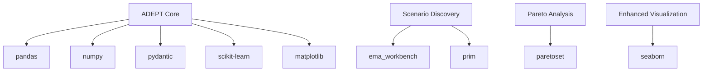

# ADEPT Dependencies

This document lists all dependencies required for the ADEPT framework, including required, optional, and development dependencies.

## Required Dependencies

These packages are essential for core functionality:

```
pandas>=1.0.0
numpy>=1.18.0
pydantic>=1.0.0
scikit-learn>=0.22.0
matplotlib>=3.0.0
```

## Optional Dependencies

These packages enable additional functionality but are not required for basic operations:

### Analysis Methods
- **ema_workbench**: Required for PRIM and CART scenario discovery
  ```
  ema_workbench>=2.0.0
  prim>=1.0.0
  ```

- **paretoset**: Required for Pareto-based analysis methods
  ```
  paretoset>=1.0.0
  ```

### Visualization
- **seaborn**: Enhanced visualization capabilities
  ```
  seaborn>=0.11.0
  ```

## Development Dependencies

These packages are used for development, testing, and documentation:

```
pytest>=6.0.0
pytest-cov>=2.0.0
Sphinx>=3.0.0
black>=20.0.0
flake8>=3.0.0
mypy>=0.700
```

## Dependency Groups

### Core Functionality
- pandas: Data manipulation and analysis
- numpy: Numerical computing
- pydantic: Data validation and settings management
- scikit-learn: Machine learning utilities (required for CART)
- matplotlib: Basic plotting capabilities

### Advanced Analysis
- ema_workbench: Scenario discovery algorithms (PRIM, CART)
- prim: Alternative PRIM implementation
- paretoset: Pareto front computation

### Visualization Enhancements
- seaborn: Statistical data visualization

## Installation

### Basic Installation
```bash
pip install pandas numpy pydantic scikit-learn matplotlib
```

### Full Installation (including optional dependencies)
```bash
pip install -r requirements.txt
```

### Development Installation
```bash
pip install -r requirements.txt
pip install pytest pytest-cov Sphinx black flake8 mypy
```

## Dependency Management

### Checking Dependencies
To verify all dependencies are installed:
```python
import pkg_resources

dependencies = [
    'pandas', 'numpy', 'pydantic', 'scikit-learn', 'matplotlib'
]

for dep in dependencies:
    try:
        pkg_resources.get_distribution(dep)
        print(f"✓ {dep} is installed")
    except pkg_resources.DistributionNotFound:
        print(f"✗ {dep} is NOT installed")
```

### Handling Missing Dependencies
The framework includes graceful handling for missing optional dependencies:

```python
try:
    from ema_workbench.analysis import prim
    from ema_workbench.analysis import cart
except ImportError:
    # Framework continues to work with limited functionality
    pass
```

## Version Compatibility

| Dependency | Minimum Version | Tested Version |
|------------|-----------------|----------------|
| pandas | 1.0.0 | 1.3.5 |
| numpy | 1.18.0 | 1.21.5 |
| pydantic | 1.0.0 | 1.9.0 |
| scikit-learn | 0.22.0 | 1.0.2 |
| matplotlib | 3.0.0 | 3.5.1 |
| ema_workbench | 2.0.0 | 2.3.0 |
| paretoset | 1.0.0 | 1.1.0 |

## Troubleshooting

### Common Dependency Issues

1. **Missing ema_workbench**: PRIM and CART functionality will be disabled
   - Solution: `pip install ema_workbench prim`

2. **Missing paretoset**: Pareto-based analysis methods will raise ImportError
   - Solution: `pip install paretoset`

3. **Version conflicts**: Some dependency versions may conflict
   - Solution: Use virtual environments or `pip install --upgrade`

### Error Messages

The framework provides clear error messages for missing dependencies:

```python
from adept.utils.exceptions import MissingDependencyError

try:
    # Some operation that requires optional dependency
    pass
except MissingDependencyError as e:
    print(f"Missing dependency: {e.dependency}")
    print(f"Details: {e.message}")
```

## Updating Dependencies

To update all dependencies to their latest versions:
```bash
pip list --outdated
pip install --upgrade -r requirements.txt
```

## Dependency Graph



This document provides a comprehensive overview of all dependencies required for the ADEPT framework to function properly.