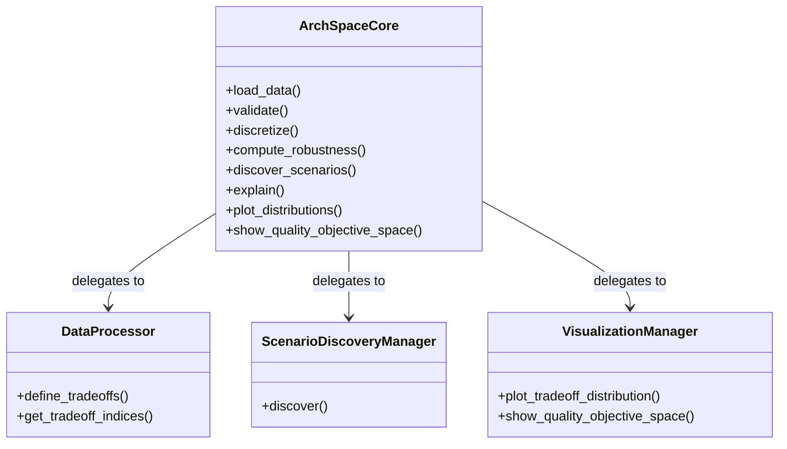

# patterns-sa

A toolkit to perform sensitivity analysis and explainability of architectural tradeoffs on patterns.

## Overview

**patterns-sa** is a Python-based framework for analyzing the performance and quality attributes of software architectural patterns. It provides a structured approach to evaluate architectural tradeoffs, discover scenarios, and explain analysis results.

## Key Features

- **Coordinator Pattern Architecture**: Centralized orchestration with specialized components
- **Multiple Analysis Methods**: PRIM, CART, Pareto analysis, and more
- **Tradeoff Exploration**: Systematic evaluation of architectural tradeoffs
- **Scenario Discovery**: Identification of parameter regions driving specific outcomes
- **Visualization Support**: Built-in plotting capabilities for analysis results
- **Extensible Design**: Easy to add new analysis methods and visualization types

## Architecture



## Installation

```bash
pip install -r requirements.txt
```

## Quick Start

```python
from adept.core.coordinator import ArchSpaceCore

# Initialize the coordinator
core = ArchSpaceCore()

# Load and analyze data
df = core.load_data("path/to/system.json")
experiments_df, outcomes_df = core.load_detailed_data("path/to/system.json")

# Discover scenarios
results = core.discover_scenarios(experiments_df, outcomes_df, "latency", method="prim")

# Visualize results
fig = core.plot_distributions(outcomes_df, schemes)
fig.show()
```

## Components

### Core Components

- **ArchSpaceCore**: Central orchestrator for the framework
- **DataLoader**: Handles data ingestion from various sources
- **DataProcessor**: Manages tradeoff definitions and discretization
- **ScenarioDiscoveryManager**: Coordinates scenario discovery algorithms
- **VisualizationManager**: Manages visualization strategies

### Analysis Methods

- **PRIM (Patient Rule Induction Method)**: Iterative parameter space exploration
- **CART (Classification And Regression Trees)**: Tree-based scenario discovery
- **Pareto Analysis**: Multi-objective optimization analysis
- **Tradeoff Analysis**: Systematic evaluation of architectural tradeoffs

### Visualization

- **Tradeoff Distribution Plots**: Visualize outcome distributions
- **Quality Objective Space**: 2D scatter plots with tradeoff overlays
- **Scenario Visualization**: Display discovered parameter regions

## Error Handling

The framework includes comprehensive error handling with custom exceptions:

- `ADEPTError`: Base exception class
- `DataLoadingError`: Data loading failures
- `ValidationError`: Data validation issues
- `DiscoveryError`: Scenario discovery problems
- `VisualizationError`: Visualization-related errors

## Documentation

For detailed usage and architecture information, see:

- `docs/design_summary.md` - Overall design overview
- `docs/design_rationale_phase1.md` - Phase 1 design decisions
- `docs/design_rationale_phase2.md` - Phase 2 enhancements
- `docs/usage.md` - Usage examples and patterns

## Contributing

Contributions are welcome! Please see the existing design patterns and follow the established architecture when adding new features.

## License

This project is licensed under the MIT License.
