# ADEPT Analysis Journey Diagram

This diagram visualizes the standard workflow for conducting architectural analysis using the ADEPT framework.

## Activity Diagram

```mermaid
graph TD
    Start([Start Analysis]) --> LoadData[Load Data & System Definition]
    
    subgraph Step1 ["1. Qualitative Shift"]
        LoadData --> DefineTradeoffs["Define Tradeoffs<br/>(Discretization / Pareto / Thresholds)"]
        DefineTradeoffs --> SplitData["Split Data<br/>(Train / Test Stratified)"]
    end
    
    subgraph Step2 ["2. Exploration & Diagnosis"]
        SplitData --> VizSpace["Visualize Objective Space<br/>(Scatter Plots)"]
        VizSpace --> DecideRefine{Tradeoffs Align<br/>with Goals?}
        DecideRefine -->|No| DefineTradeoffs
        DecideRefine -->|Yes| Contingency["Analyze Contingency<br/>(Decisions vs. Outcomes)"]
        Contingency --> FeatureScoring["Compute Feature Scores<br/>(Identify Key Drivers)"]
    end
    
    subgraph Step3 ["3. Discovery & Rules"]
        FeatureScoring --> Discovery["Discover Scenarios<br/>(PRIM / CART)"]
        Discovery -->|Returns| Boxes["Operating Envelopes<br/>(Boxes)"]
        Boxes --> VizImpact["Visualize Box Impact<br/>(Highlight Constraints)"]
    end
    
    subgraph Step4 ["4. Robustness & What-If"]
        VizImpact --> BaselineRobustness["Compute Baseline Robustness<br/>(STARR / Regret / Stability Radius)"]
        BaselineRobustness --> AlignBoxes["Align Boxes to Tradeoffs"]
        AlignBoxes --> WhatIf["Compute Improvement Matrix<br/>(What-If Analysis)"]
        WhatIf --> CompareHeatmap["Visualize Comparison<br/>(Baseline vs. Boxed)"]
    end
    
    CompareHeatmap --> End([End Analysis])

    %% Styling
    style Start fill:#f9f,stroke:#333,stroke-width:2px
    style End fill:#f9f,stroke:#333,stroke-width:2px
    style Boxes fill:#ff9,stroke:#333,stroke-width:2px
    style DecideRefine fill:#fcf,stroke:#333,stroke-width:2px,shape:diamond
```

## Detailed Workflow Steps

### 0. Initialization
*   **Load Data & System Definition**: Ingests the `system.json` declarative model and parses the raw simulation results (CSV) into structured dataframes.

### 1. Qualitative Shift
*   **Define Tradeoffs**: Translates continuous numeric variables into architectural concepts (e.g., "Fast" vs "Slow") using automated engines for Discretization, Pareto Frontiers, or Static Thresholds (SLAs).
*   **Split Data**: Partitions the dataset into Training and Test sets using a stratified approach to ensure all tradeoff regions are represented in both subsets.

### 2. Exploration & Diagnosis
*   **Visualize Objective Space**: Generates scatter plots to map the multi-dimensional tradeoff regions.
*   **Decision (Refine Tradeoffs?)**: Checks if the visualized regions align with architectural goals. If not, the user loops back to redefine thresholds or bins.
*   **Analyze Contingency**: Computes the probabilistic relationship between architectural decisions (Policies) and outcomes (Tradeoffs).
*   **Compute Feature Scores**: Uses Random Forest algorithms to rank system parameters by their influence.

### 3. Discovery & Rules
*   **Discover Scenarios**: Employs algorithms like PRIM or CART to find specific ranges of parameters (Operating Envelopes) that reliably satisfy desired tradeoffs.
*   **Visualize Box Impact**: Highlights exactly where the discovered envelopes fall within the overall objective space.

### 4. Robustness & What-If Analysis
*   **Compute Baseline Robustness**: Quantifies the stability of each policy using STARR, Regret, or Stability Radius.
*   **Align Boxes to Tradeoffs**: Maps discovered scenario rules back to their target tradeoff definitions.
*   **Compute Improvement Matrix**: Simulates a "What-If" scenario where the system is forced into the discovered operating envelopes.
*   **Visualize Comparison**: Renders vertically stacked heatmaps comparing **Baseline** vs. **Improved** performance.