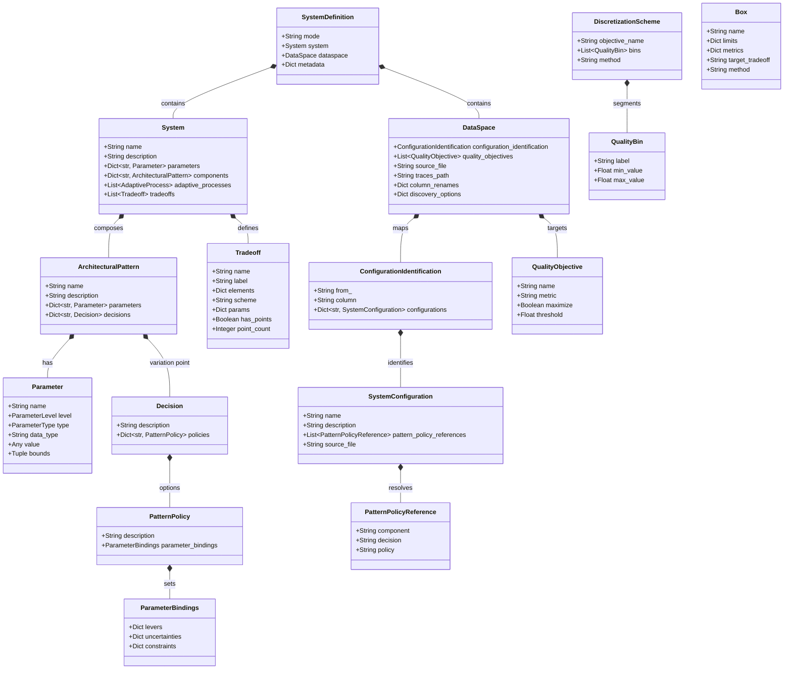

# ADEPT Data Model

This document describes the core entities and relationships within the ADEPT framework, as defined by the Pydantic models in `adept/core/models.py`.

## Entity Relationship Diagram

## Key Entities

### SystemDefinition
The root declarative specification for an ADEPT analysis. It links the architectural structure (`System`) to the experimental data configuration (`DataSpace`).

### System
The architectural model of the software under study. It acts as a container for pattern instances, global parameters, and the desired performance tradeoffs.

### ArchitecturalPattern
A reusable design template (e.g., CQRS, Gateway Offloading) containing specific parameters and architectural decisions.

### Tradeoff
A first-class element defining a region of interest in the multi-dimensional outcome space (e.g., "Fast and Cheap").

### Box
A discovered region in the parameter space (usually via PRIM or CART) that reliably leads to a specific tradeoff.
