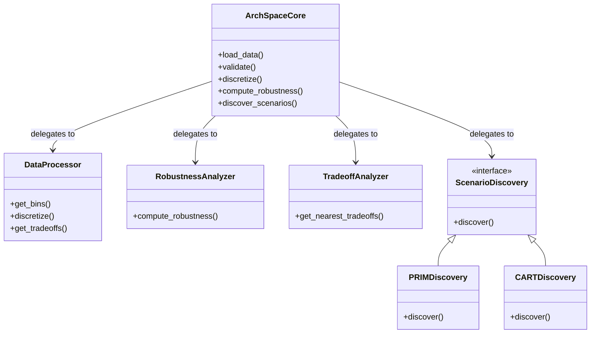
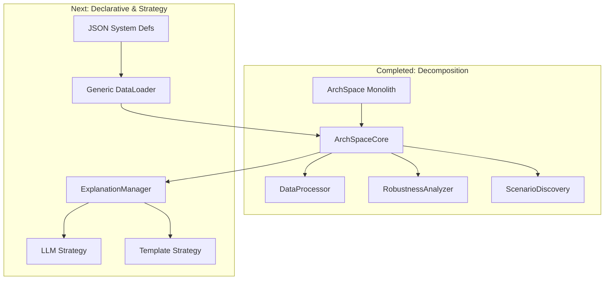

# Design Rationale: ArchSpace Framework Refactoring (v2)

This document captures the architectural decisions and rationale behind the refactoring of the `ArchSpace` framework, transitioning from a monolithic "God Class" to a modular, composition-based architecture.

## 1. Architectural Drivers

The primary drivers for this refactoring were:

1.  **Maintainability:** The original `ArchSpace` class was too large, mixing data loading, processing, analysis, and visualization.
2.  **Extensibility:** Adding new analysis methods (e.g., a new scenario discovery algorithm) required modifying the core class.
3.  **Testability:** Testing individual components of the monolith was difficult due to tight coupling.
4.  **Modernization:** Adopting standard design patterns (Coordinator, Strategy) to align with modern software engineering practices.

## 2. The New Architecture: Coordinator & Composition

We have moved to a **Coordinator Pattern** where `ArchSpaceCore` acts as the central orchestrator, delegating specific responsibilities to specialized, single-purpose components.

### 2.1 High-Level Diagram

### 2.2 Component Responsibilities

*   **`ArchSpaceCore` (The Coordinator):**
    *   **Role:** The entry point for the API. It holds instances of the analyzer classes and routes method calls to them.
    *   **Rationale:** Keeps the client interface stable while allowing the internal implementation to change. It allows for dependency injection of components.

*   **`DataProcessor`:**
    *   **Role:** Pure data transformation. Handles binning, discretization, and label management.
    *   **Rationale:** Separates *how* data is prepared from *how* it is analyzed.

*   **`RobustnessAnalyzer`:**
    *   **Role:** Calculates quantitative metrics (robustness).
    *   **Rationale:** Encapsulates the specific mathematical logic for robustness, making it easier to test and replace.

*   **`TradeoffAnalyzer`:**
    *   **Role:** Explores the solution space (e.g., finding nearest neighbors).
    *   **Rationale:** Isolates the complexity of solution space traversal and distance metrics.

*   **`ScenarioDiscovery` (Strategy Pattern):**
    *   **Role:** Explains *why* outcomes happen using algorithms like PRIM or CART.
    *   **Rationale:** Different algorithms have different implementations and dependencies. The Strategy pattern allows switching between them (e.g., `method='prim'` vs `method='cart'`) seamlessly.

## 3. Pending Improvements & Next Steps (Phase 2)

While Phase 1 (Decomposition) is complete, several key architectural improvements are scheduled for Phase 2:

### 3.1 Declarative Data Loading (JSON Schema)
*   **Current State:** Data loading is handled by generic loaders or hardcoded in legacy pattern subclasses.
*   **Target State:** Implement a generic `DataLoader` that reads `system.json` files (as defined in `docs/json_schema_usage.md`). This will drive the configuration of the analysis pipeline entirely from metadata.

### 3.2 Strategy Pattern for Explanations
*   **Current State:** Explanation logic is either embedded or ad-hoc.
*   **Target State:** Implement an `ExplanationManager` with an `IExplanationStrategy` interface. This will allow us to plug in different explanation engines, such as:
    *   `TemplateExplainerStrategy`: Simple text templates.
    *   `LLMExplainerStrategy`: Generative AI explanations.

### 3.3 Full Migration of Patterns
*   **Current State:** Legacy patterns (`CQRS`, `Gateway`, etc.) still use the old `ArchSpace` class and notebooks.
*   **Target State:** All pattern notebooks must be refactored to use the new `ArchSpaceCore` and the new JSON-based loading mechanism.

