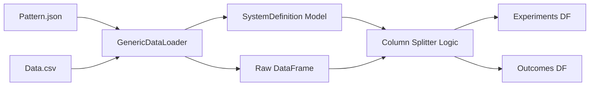
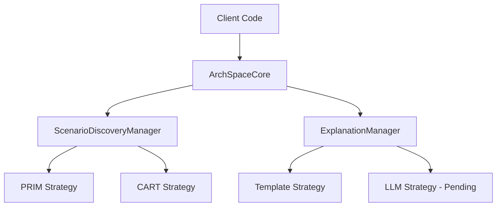

# Design Rationale: Phase 2 - Declarative Loading and Strategy Management

This document outlines the architectural enhancements implemented during Phase 2 of the `ArchSpace` framework refactoring. While Phase 1 focused on decomposing the monolith, Phase 2 establishes the metadata-driven foundation and pluggable strategy management.

## 1. Architectural Drivers for Phase 2

1.  **Metadata-Driven Configuration:** Decoupling the system structure (parameters, objectives, policies) from the Python code using a standardized JSON schema.
2.  **Algorithm Pluggability:** Allowing seamless switching between different analysis algorithms (PRIM vs. CART) and explanation engines (Template vs. LLM).
3.  **Consistency:** Ensuring all architectural patterns follow the same data-loading and reporting lifecycle.

## 2. Key Components and Design Decisions

### 2.1 Declarative Data Loading (`archspaces/loader.py`)
We implemented the `GenericDataLoader` which operates on the `SystemDefinition` Pydantic model. 
- **Decision:** The loader is now the source of truth for splitting raw data into `experiments_df` and `outcomes_df` based on the JSON metadata.
- **Decision:** Support for both single-file datasets (column-based policies) and multi-file datasets (file-based policies) was integrated.

### 2.2 Strategy Management (`archspaces/discovery.py`, `archspaces/explanations.py`)
We introduced "Manager" classes to act as registries and factories for strategies.
- **`ScenarioDiscoveryManager`:** Manages algorithms like `PRIMDiscovery` and `CARTDiscovery`. It handles the instantiation and selection of the algorithm requested by the user.
- **`ExplanationManager`:** Manages how analysis results are translated into human-readable text. It currently supports `TemplateExplainerStrategy`.

### 2.3 Updated Coordinator (`archspaces/core.py`)
`ArchSpaceCore` was updated to act as a high-level hub, delegating the orchestration of these managers.

## 3. Diagrams

### 3.1 Metadata-Driven Data Flow
This diagram illustrates how the `GenericDataLoader` uses the JSON schema to prepare data for analysis.

### 3.2 Strategy Orchestration
How the Coordinator interacts with the Managers to execute specific analysis tasks.

## 4. Pending Improvements & Next Steps

The following items remain for Phase 3 and beyond:

1.  **LLM Implementation:** While the `ExplanationManager` is ready, the actual `LLMExplainerStrategy` (integrating with LiteLLM or OpenAI) needs to be implemented.
2.  **Legacy Pattern Migration:** The existing architectural patterns (CQRS, Gateway, etc.) are still using legacy code. They need to be migrated to provide `*.json` definitions and use the `ArchSpaceCore` API.
3.  **Visualization Integration:** Standardizing the visualization functions (currently standalone functions in `archspace.py`) into a `VisualizationManager` or similar component within the core framework.
4.  **Schema Validation Enhancements:** Improving the `GenericDataLoader` to handle complex column renames and data type coercions more robustly during the loading phase.
