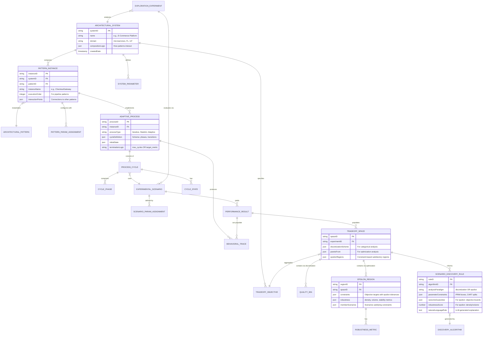
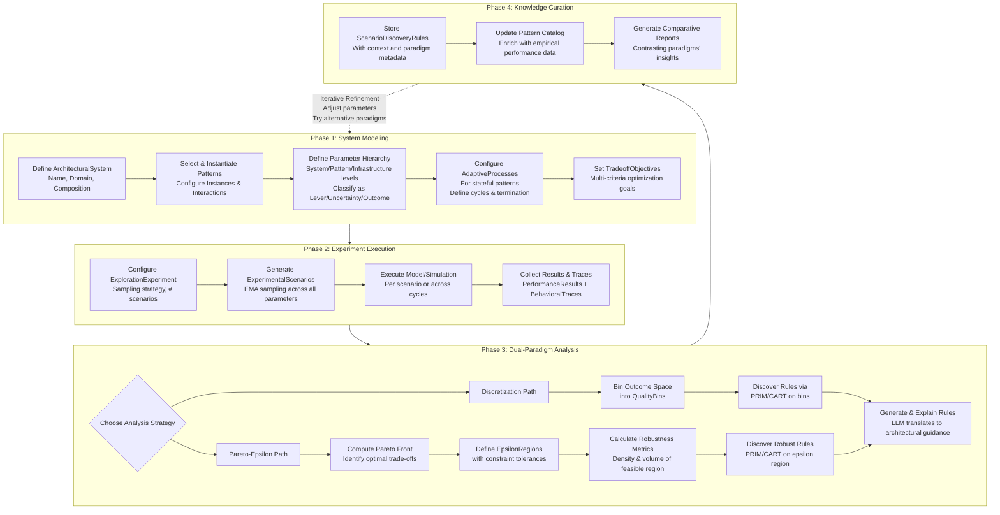

# ADEPT Framework: Functional Specification

## **Document Version: 2.0**
## **Status: Proposal for Implementation**

## **Executive Summary**

**ADEPT** (**A**rchitectural **D**ecision **E**xploration and **P**attern **T**radeoffs) is a Python-based software framework for data-driven exploration and analysis of architectural patterns in software systems. It enables quantitative evaluation of architectural decisions through computational experimentation, sensitivity analysis, and scenario discovery using **dual analytical paradigms**: intuitive discretization for exploration and rigorous Pareto-epsilon optimization for robust design.

The framework uniquely supports both **static architectures** (e.g., microservices) and **adaptive, stateful systems** (e.g., Federated Learning) under a unified model.

**Core Value Proposition**: Transform architectural questions into data-driven, explainable insights through systematic experimentation, supporting both initial design exploration and rigorous robustness analysis.

## **1. Introduction & Conceptual Foundation**

### **1.1 Dual Analytical Paradigms**
ADEPT introduces two complementary approaches to analyzing design trade-offs:

1.  **Discretization-Based Exploration**: The original intuitive method where outcome spaces are divided into categorical regions (e.g., `fast/average/slow`). This approach is ideal for **initial discovery, stakeholder communication, and understanding basic relationships** between parameters and outcomes.

2.  **Pareto-Epsilon Optimization**: An advanced paradigm incorporating **Pareto dominance** and **epsilon-constrained regions**. This approach enables:
    *   Formal identification of optimal trade-offs (Pareto fronts)
    *   Definition of satisfactory performance regions with tolerances
    *   Direct quantification of **robustness** as the density/volume of feasible parameter regions
    *   Epsilon-constrained scenario discovery for finding robust design spaces

These paradigms are **not mutually exclusive** but represent different stages and depths of analysis within the same framework.

### **1.2 Validated Foundations**
The framework's conceptual model has been validated against two research paradigms:
*   **Static Pattern Analysis**: Based on "Data-driven Understanding of Design Decisions in Pattern-based Microservices Architecture" (ECSA 2025)
*   **Adaptive System Analysis**: Based on "Experimenting Architectural Patterns in Federated Learning Systems" (JSS 2026)

## **2. Complete Conceptual Model**

### **2.1 Unified Entity-Relationship Model**



### **2.2 Entity Definitions**

#### **Core Architectural Entities**
- **`ArchitecturalSystem`**: A complete software system composed of multiple pattern instances with defined interaction logic.
- **`ArchitecturalPattern`**: A reusable design solution template (e.g., Gateway Offloading, Client Selector) from a catalog.
- **`PatternInstance`**: A concrete instantiation of a pattern within a system, with specific parameter assignments and execution order.

#### **Parameter Hierarchy**
Parameters exist at three levels with EMA-inspired classification:

| **Level** | **EMA Type** | **Controllable?** | **Examples** |
|-----------|--------------|-------------------|--------------|
| **System** | Lever | ✅ Yes | `total_replicas`, `deployment_region` |
| | Uncertainty | ❌ No | `peak_load_multiplier`, `data_growth_rate` |
| | Outcome | 📊 Measured | `availability_SLA`, `total_cost` |
| **Pattern** | Lever | ✅ Yes | `offload_amount`, `cache_ttl` |
| | Uncertainty | ❌ No | `cache_hit_ratio`, `dependency_latency` |
| | Constraint | 🔒 Fixed | `max_connections`, `protocol_version` |
| **Infrastructure** | Resource Lever | ✅ Yes | `vm_size`, `storage_iops` |
| | Physical Constraint | 🔒 Fixed | `rack_space`, `cooling_capacity` |

#### **Dual Analysis Paradigms**

**1. Discretization-Based Analysis:**
- **`QualityBin`**: Represents a categorical region in outcome space (e.g., `fast` response, `high` utilization). Used for intuitive exploration and stakeholder communication.
- **`DiscretizationScheme`**: The mapping from continuous metric values to categorical bins.

**2. Pareto-Epsilon Optimization:**
- **`ParetoFront`**: The set of non-dominated solutions representing optimal trade-offs.
- **`EpsilonRegion`**: A region in outcome space defined by constraints with tolerances (e.g., `latency ≤ 150ms ± 10ms`).
- **`RobustnessMetric`**: Quantitative measures of design robustness:
  - **Density**: Percentage of scenarios within the epsilon region
  - **Volume**: Hypervolume of the parameter region satisfying constraints
  - **StabilityIndex**: Variance of outcomes within the region

#### **Adaptive Process Extension**
- **`AdaptiveProcess`**: A stateful, iterative process implemented by a pattern (e.g., FL training loop, autoscaler control cycle). Captures the *temporal behavior* missing from static analysis.
- **`ProcessCycle`**: A single iteration of the process, linked to a specific `ExperimentalScenario`.
- **`BehavioralTrace`**: A time-series recording of outcome metrics across cycles—enabling convergence analysis, stability checks, and temporal sensitivity.

#### **Experimentation & Analysis**
- **`ExplorationExperiment`**: A coordinated study of a system across a defined parameter space.
- **`ExperimentalScenario`**: A single point in the parameter space (specific lever settings + uncertainty realizations).
- **`TradeoffSpace`**: The multi-dimensional space of outcome metrics, supporting both discretization and Pareto-epsilon representations.
- **`ScenarioDiscoveryRule`**: An interpretable constraint on parameters, generated via either discretization or epsilon-constrained analysis, with LLM-generated explanation.

### **2.3 Complete Framework Workflow**



## **3. Implementation Architecture**

### **3.1 Enhanced Python Module Structure**

```
arch_explore_framework/
├── core/                           # Domain models & system composition
│   ├── __init__.py
│   ├── models.py                   # Pydantic entity definitions
│   ├── system_builder.py           # System composition API
│   ├── parameter_registry.py       # Parameter definition & validation
│   └── pattern_catalog.py          # Load/store pattern definitions
├── experiment/                     # Experiment design & execution
│   ├── __init__.py
│   ├── design.py                   # Sampling strategies (EMA integration)
│   ├── orchestrator.py             # Parallel execution manager
│   ├── evaluator.py                # Scenario evaluation interface
│   └── adaptors/                   # Connectors to simulation tools
│       ├── base_adaptor.py
│       ├── queueing_network.py     # For QN models (microservices paper)
│       ├── federated_learning.py   # For FL systems (FL paper)
│       └── docker_simulator.py     # For containerized benchmarks
├── analysis/                       # Enhanced analysis modules
│   ├── __init__.py
│   ├── sensitivity.py              # SALib integration
│   ├── tradeoffs.py                # Dual-paradigm tradeoff analysis
│   ├── discretization.py           # Quality bin creation & management
│   ├── pareto.py                   # Pareto front computation
│   ├── epsilon_regions.py          # Epsilon constraint handling
│   ├── robustness.py               # Robustness metrics computation
│   ├── discovery.py                # PRIM/CART for both paradigms
│   ├── explainer.py                # LLM rule explanation
│   └── visualization.py            # Results plotting for both paradigms
├── storage/                        # Data persistence
│   ├── __init__.py
│   ├── repository.py               # CRUD for entities
│   ├── results_store.py            # Time-series data handling
│   └── knowledge_base.py           # Rule storage & retrieval
├── api/                            # Interfaces
│   ├── __init__.py
│   ├── cli.py                      # Command-line interface
│   ├── web_api.py                  # REST API (FastAPI)
│   └── notebook_utils.py           # Jupyter helpers
└── utils/
    ├── __init__.py
    ├── config_loader.py            # YAML/JSON configuration
    ├── validation.py               # Schema validation
    └── logging_config.py
```

### **3.2 Enhanced Core API Specification**

#### **3.2.1 Dual-Paradigm Analysis API**
```python
# analysis/tradeoffs.py
class DualParadigmAnalyzer:
    """Orchestrates both discretization and Pareto-epsilon analysis"""
    
    def analyze_tradeoffs(self, 
                         results: ExperimentResults,
                         strategy: Literal["discretization", "pareto_epsilon", "both"] = "both",
                         config: Dict[str, Any] = None) -> TradeoffSpace:
        """
        Perform trade-off analysis using the specified paradigm(s).
        
        Args:
            results: Experiment results to analyze
            strategy: Which analysis paradigm(s) to use
            config: Paradigm-specific configuration
        
        Returns:
            TradeoffSpace with populated analysis results
        """
        tradeoff_space = TradeoffSpace()
        
        if strategy in ["discretization", "both"]:
            # Apply discretization analysis
            discretization_config = config.get("discretization", {})
            bins = self._create_quality_bins(results, discretization_config)
            tradeoff_space.discretization_scheme = {
                "bins": bins,
                "method": discretization_config.get("method", "equal_width")
            }
        
        if strategy in ["pareto_epsilon", "both"]:
            # Apply Pareto-epsilon analysis
            pareto_config = config.get("pareto_epsilon", {})
            
            # Compute Pareto front
            pareto_front = self._compute_pareto_front(
                results, 
                pareto_config.get("objectives")
            )
            tradeoff_space.pareto_front = pareto_front
            
            # Define epsilon regions if specified
            if "epsilon_constraints" in pareto_config:
                epsilon_regions = self._define_epsilon_regions(
                    results,
                    pareto_config["epsilon_constraints"]
                )
                tradeoff_space.epsilon_regions = epsilon_regions
        
        return tradeoff_space
    
    def _compute_pareto_front(self, results, objectives):
        """Compute non-dominated solutions using fast non-dominated sort"""
        # Implementation using Platypus or custom algorithm
        pass
    
    def _define_epsilon_regions(self, results, constraints):
        """Define satisfactory regions with epsilon tolerances"""
        regions = []
        for constraint_set in constraints:
            region = {
                "constraints": constraint_set,
                "member_scenarios": self._find_satisfying_scenarios(results, constraint_set),
                "robustness": self._compute_robustness_metrics(results, constraint_set)
            }
            regions.append(region)
        return regions
    
    def _compute_robustness_metrics(self, results, constraints):
        """Calculate density and volume of satisfactory region"""
        satisfying_scenarios = self._find_satisfying_scenarios(results, constraints)
        
        density = len(satisfying_scenarios) / len(results.scenarios)
        
        # Calculate hypervolume of parameter space region
        volume = self._calculate_hypervolume(satisfying_scenarios)
        
        return {"density": density, "volume": volume, "stability": self._compute_stability(satisfying_scenarios)}
```

#### **3.2.2 Enhanced Scenario Discovery API**
```python
# analysis/discovery.py
class EnhancedScenarioDiscovery:
    """Scenario discovery supporting both paradigms"""
    
    def discover_rules(self,
                      tradeoff_space: TradeoffSpace,
                      target_spec: Dict[str, Any],
                      algorithm: str = "prim") -> List[ScenarioDiscoveryRule]:
        """
        Discover rules based on the specified analysis paradigm.
        
        Args:
            tradeoff_space: Populated tradeoff space from analysis
            target_spec: Specification of what to discover rules for
            algorithm: Discovery algorithm to use (PRIM, CART)
        
        Returns:
            List of discovered rules with paradigm-specific metadata
        """
        rules = []
        
        paradigm = target_spec.get("paradigm", "discretization")
        
        if paradigm == "discretization":
            # Traditional discretization-based discovery
            target_bin = target_spec["target_bin"]
            scenarios = self._get_scenarios_for_bin(tradeoff_space, target_bin)
            rules = self._discover_via_prim(scenarios, algorithm)
            
            # Add paradigm metadata
            for rule in rules:
                rule.analysis_paradigm = "discretization"
                rule.target_condition = f"outcome in bin '{target_bin}'"
        
        elif paradigm == "epsilon":
            # Epsilon-constrained region discovery
            region_id = target_spec["region_id"]
            epsilon_region = tradeoff_space.get_epsilon_region(region_id)
            scenarios = epsilon_region["member_scenarios"]
            
            # Apply PRIM/CART to find parameter bounds of robust region
            rules = self._discover_via_prim(scenarios, algorithm)
            
            # Enhance with robustness metrics
            for rule in rules:
                rule.analysis_paradigm = "epsilon"
                rule.outcome_guarantee = self._format_epsilon_guarantee(epsilon_region["constraints"])
                rule.robustness_score = epsilon_region["robustness"]["density"]
                rule.target_condition = f"meets epsilon constraints with robustness {rule.robustness_score:.2%}"
        
        # Generate explanations for all rules
        for rule in rules:
            rule.natural_language_rule = self._generate_explanation(rule, tradeoff_space.system_context)
        
        return rules
    
    def _format_epsilon_guarantee(self, constraints):
        """Format epsilon constraints as human-readable guarantee"""
        guarantees = []
        for const in constraints:
            if const["operator"] == "<=":
                guarantees.append(f"{const['objective']} ≤ {const['value']} ± {const['epsilon']}")
            elif const["operator"] == ">=":
                guarantees.append(f"{const['objective']} ≥ {const['value']} ± {const['epsilon']}")
        return " AND ".join(guarantees)
```

### **3.3 Enhanced Configuration File Format**

#### **System Definition with Dual Analysis Support**
```yaml
# system_definition.yaml
system:
  name: "FederatedLearning-Healthcare"
  domain: "healthcare"
  description: "FL system for medical image analysis"
  
analysis_strategies:
  # Option 1: Discretization for initial exploration
  discretization:
    enabled: true
    method: "equal_frequency"  # or "equal_width", "custom"
    bins_per_metric: 3
    bin_labels: ["low", "medium", "high"]
  
  # Option 2: Pareto-epsilon for robust optimization
  pareto_epsilon:
    enabled: true
    objectives:
      - metric: "model_accuracy"
        direction: "maximize"
        weight: 0.6
      - metric: "training_time"
        direction: "minimize"
        weight: 0.3
      - metric: "energy_consumption"
        direction: "minimize"
        weight: 0.1
    
    epsilon_regions:
      - name: "high_performance"
        constraints:
          - objective: "model_accuracy"
            operator: ">="
            value: 0.92
            epsilon: 0.02
          - objective: "training_time"
            operator: "<="
            value: 3600  # seconds
            epsilon: 300
        min_robustness_density: 0.70
      
      - name: "cost_effective"
        constraints:
          - objective: "energy_consumption"
            operator: "<="
            value: 500  # kWh
            epsilon: 50
          - objective: "model_accuracy"
            operator: ">="
            value: 0.85
            epsilon: 0.05

patterns:
  # Pattern definitions remain the same
  - type: "ClientSelector"
    instance_name: "capability_selector"
    parameters: [...]
```

#### **Experiment Configuration with Paradigm Selection**
```yaml
# experiment_config.yaml
experiment:
  name: "Multi-Paradigm FL Analysis"
  
  # Execution settings (unchanged)
  sampling:
    method: "sobol"
    n_scenarios: 5000
  
  # Analysis configuration with both paradigms
  analysis:
    # Sensitivity analysis (applies to both paradigms)
    sensitivity:
      methods: ["sobol", "morris"]
    
    # Paradigm-specific configurations
    paradigms:
      discretization:
        enabled: true
        discovery:
          target_bins: ["high_accuracy_low_time", "balanced_performance"]
          algorithm: "prim"
      
      pareto_epsilon:
        enabled: true
        discovery:
          target_regions: ["high_performance", "cost_effective"]
          algorithm: "cart"
          robustness_threshold: 0.65
    
    # Explanation generation
    explanation:
      llm_provider: "openai"
      compare_paradigms: true  # Generate comparative insights
```

## **4. Feature Breakdown & User Stories**

### **Feature Set 1: Dual-Paradigm Analysis**
**F1.1 - Flexible Trade-off Analysis Strategies**
- *As an architect, I want to choose between simple discretization for initial exploration and rigorous Pareto-epsilon analysis for robust optimization, so I can apply the right tool for each design stage.*
- **Implementation**: `DualParadigmAnalyzer` with strategy selection.

**F1.2 - Epsilon-Constrained Region Definition**
- *As a systems engineer, I want to define satisfactory performance regions with tolerance ranges (epsilon), so I can analyze designs that are robust to real-world variations.*
- **Implementation**: `EpsilonRegion` entity with constraint validation.

**F1.3 - Quantitative Robustness Metrics**
- *As a reliability engineer, I want to measure design robustness as the density and volume of parameter regions satisfying constraints, so I can objectively compare architectural alternatives.*
- **Implementation**: `RobustnessMetric` computation with hypervolume algorithms.

### **Feature Set 2: Comparative Insight Generation**
**F2.1 - Cross-Paradigm Rule Comparison**
- *As a decision-maker, I want to see rules discovered through both discretization and epsilon methods side-by-side, so I can understand the trade-offs between simple heuristics and robust guarantees.*
- **Implementation**: Rule comparison visualization with consistency metrics.

**F2.2 - Paradigm Recommendation Engine**
- *As a novice user, I want the framework to recommend which analysis paradigm to use based on my system characteristics and goals, so I can get the most appropriate insights.*
- **Implementation**: Heuristic-based paradigm recommendation.

### **Feature Set 3: Enhanced Visualization**
**F3.1 - Parallel Coordinate Plots with Dual Highlighting**
- *As an analyst, I want to visualize both discretization bins and epsilon regions on parallel coordinate plots, so I can see how parameter ranges map to different outcome classifications.*
- **Implementation**: Enhanced plotting with dual highlighting.

## **5. Enhanced Integration with Target Libraries**

### **5.1 Platypus Integration for Pareto Analysis**
```python
# analysis/pareto.py
class PlatypusParetoAnalyzer:
    """Integration with Platypus library for multi-objective optimization"""
    
    def compute_pareto_front(self, results, objectives):
        from platypus import NSGAII, Problem, Real
        
        # Define optimization problem
        problem = Problem(len(results.parameters), len(objectives))
        
        # Set parameter bounds
        for i, param in enumerate(results.parameters):
            problem.types[i] = Real(param.bounds[0], param.bounds[1])
        
        # Define objective functions
        problem.function = self._create_objective_function(results, objectives)
        
        # Run optimization
        algorithm = NSGAII(problem)
        algorithm.run(1000)  # Number of evaluations
        
        # Extract Pareto front
        pareto_front = []
        for solution in algorithm.result:
            if solution.rank == 0:  # Non-dominated solutions
                pareto_front.append({
                    "parameters": solution.variables,
                    "objectives": solution.objectives
                })
        
        return pareto_front
```

### **5.2 Enhanced SALib Integration for Robustness**
```python
# analysis/robustness.py
class RobustnessAnalyzer:
    """Advanced robustness analysis using sensitivity techniques"""
    
    def analyze_region_robustness(self, epsilon_region, full_results):
        """
        Analyze how sensitive the epsilon region is to parameter variations.
        
        Returns metrics beyond simple density/volume:
        - Parameter importance for region membership
        - Interaction effects threatening robustness
        - Boundary stability
        """
        # Create binary outcome: 1 if in region, 0 otherwise
        region_membership = self._create_membership_vector(epsilon_region, full_results)
        
        # Use SALib to analyze which parameters most affect region membership
        problem = self._create_salib_problem(full_results.parameters)
        
        # Sobol analysis on region membership
        Si = sobol.analyze(problem, region_membership, print_to_console=False)
        
        robustness_metrics = {
            "density": epsilon_region["robustness"]["density"],
            "volume": epsilon_region["robustness"]["volume"],
            "parameter_importance": self._extract_importance_ranking(Si),
            "interaction_threats": self._identify_interaction_threats(Si),
            "boundary_stability": self._compute_boundary_stability(epsilon_region)
        }
        
        return robustness_metrics
```

## **6. Example Usage: Dual-Paradigm Analysis**

### **6.1 Microservice Gateway Analysis**
```python
# Example using both paradigms for Gateway Offloading
from arch_explore_framework import SystemBuilder, ExperimentOrchestrator, DualParadigmAnalyzer

# 1. Define system and run experiment (as before)
builder = SystemBuilder()
system = builder.create_system("ECommerce-Microservices", "microservices")
# ... add patterns, parameters, objectives ...

orchestrator = ExperimentOrchestrator()
experiment = orchestrator.design_experiment(system, n_scenarios=1000)
results = orchestrator.run_experiment(experiment, evaluator=queueing_network_evaluator)

# 2. Apply DUAL-PARADIGM analysis
analyzer = DualParadigmAnalyzer()

# Strategy 1: Discretization for quick insights
discretization_config = {
    "method": "equal_frequency",
    "bins_per_metric": 3,
    "bin_labels": ["low", "medium", "high"]
}

# Strategy 2: Pareto-epsilon for robust design
pareto_config = {
    "objectives": [
        {"metric": "response_time", "direction": "minimize", "weight": 0.7},
        {"metric": "utilization", "direction": "target", "target": 0.8, "weight": 0.3}
    ],
    "epsilon_constraints": [
        {
            "name": "responsive_and_efficient",
            "constraints": [
                {"objective": "response_time", "operator": "<=", "value": 150, "epsilon": 20},
                {"objective": "utilization", "operator": ">=", "value": 0.7, "epsilon": 0.1}
            ]
        }
    ]
}

# Run both analyses
tradeoff_space = analyzer.analyze_tradeoffs(
    results,
    strategy="both",
    config={
        "discretization": discretization_config,
        "pareto_epsilon": pareto_config
    }
)

# 3. Compare insights from both paradigms
print("=== DISCRETIZATION-BASED RULES ===")
discrete_rules = analyzer.discover_rules(
    tradeoff_space,
    {"paradigm": "discretization", "target_bin": "low_response_high_util"}
)
for rule in discrete_rules:
    print(f"- {rule.natural_language_rule}")

print("\n=== EPSILON-CONSTRAINED ROBUST RULES ===")
epsilon_rules = analyzer.discover_rules(
    tradeoff_space,
    {"paradigm": "epsilon", "region_id": "responsive_and_efficient"}
)
for rule in epsilon_rules:
    print(f"- {rule.natural_language_rule}")
    print(f"  Robustness: {rule.robustness_score:.1%} density")
```

## **7. Implementation Roadmap**

### **Phase 1: Core Foundation with Dual Paradigms (Weeks 1-8)**
**Objective**: Working system modeling with both analysis paradigms.
- Week 1-3: Enhanced entity models supporting both paradigms
- Week 4-5: Discretization analysis module
- Week 6-8: Pareto-epsilon analysis module with Platypus integration

### **Phase 2: Robustness & Advanced Analysis (Weeks 9-16)**
**Objective**: Complete robust optimization capabilities.
- Week 9-11: Epsilon region definition and validation
- Week 12-14: Robustness metrics computation (density, volume, stability)
- Week 15-16: Enhanced SALib integration for robustness sensitivity

### **Phase 3: Comparative Insights (Weeks 17-22)**
**Objective**: Tools for comparing and synthesizing insights across paradigms.
- Week 17-19: Cross-paradigm rule comparison and visualization
- Week 20-22: Paradigm recommendation engine

### **Phase 4: Integration & Deployment (Weeks 23-30)**
**Objective**: Production-ready framework with dual-paradigm support.
- Week 23-25: Unified API and configuration system
- Week 26-28: Comprehensive documentation with paradigm examples
- Week 29-30: Performance optimization and validation

## **8. Conclusion**

### **8.1 Summary of Dual-Paradigm Innovation**
ADEPT represents a significant advance in software architecture tooling by providing **two complementary analytical paradigms in one unified framework**:

1. **Discretization-Based Exploration**: For intuitive, communicative analysis perfect for early design stages and stakeholder engagement.
2. **Pareto-Epsilon Optimization**: For rigorous, robustness-focused analysis suitable for final design validation and optimization.

### **8.2 Key Benefits**
- **Flexibility**: Choose the right tool for each analysis stage
- **Comparative Insights**: Gain deeper understanding by comparing paradigm results
- **Quantifiable Robustness**: Move from qualitative to quantitative robustness assessment
- **Backward Compatibility**: Support for existing discretization-based approaches while enabling advanced optimization

### **8.3 Immediate Next Steps**
1. **Core Implementation**: Begin with entity models supporting both paradigms
2. **Validation Studies**: Apply both paradigms to the source paper examples
3. **Community Engagement**: Release as open-source to demonstrate the value of dual-paradigm analysis

---

