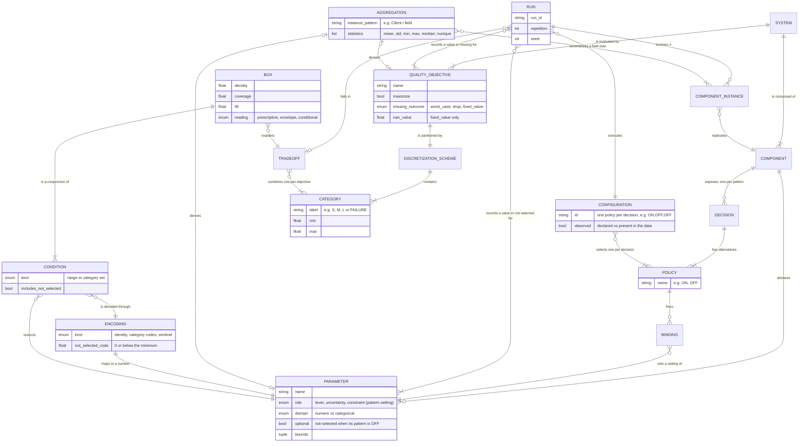
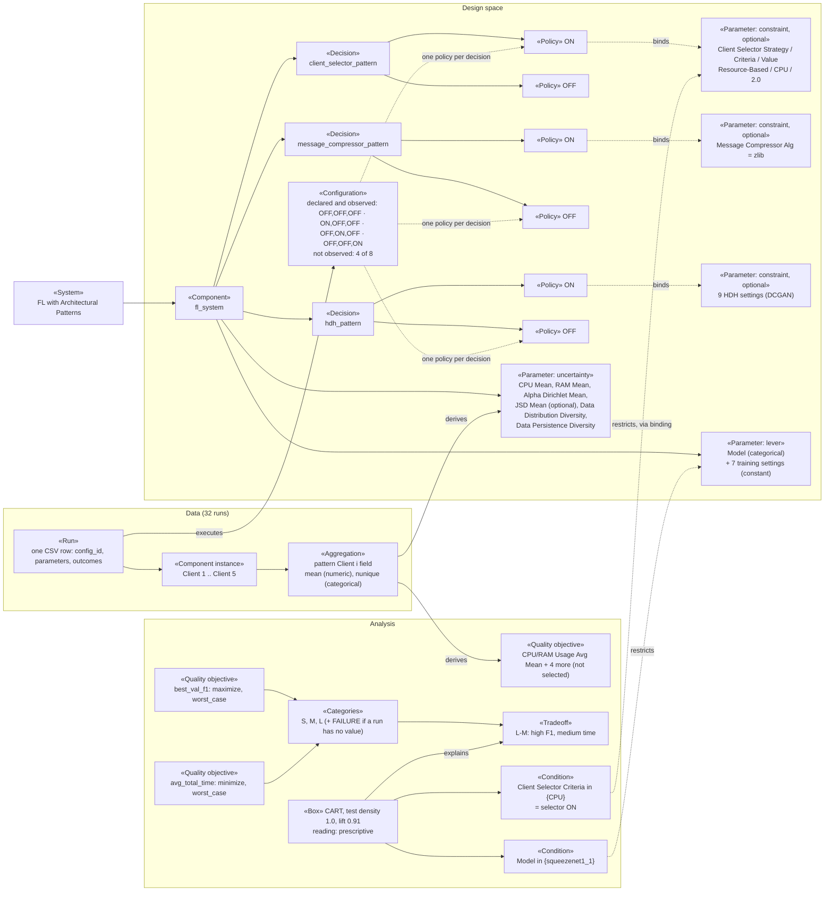
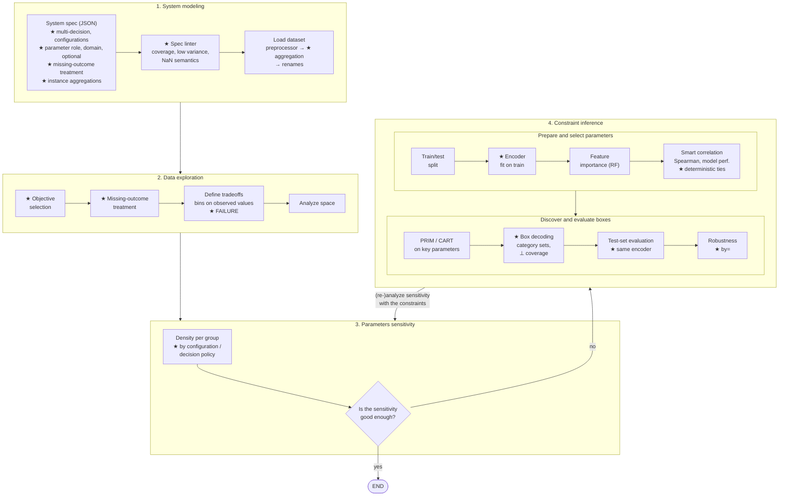

# ADEPT Extension: Concepts, Pipeline and Formal Treatment of Mixed Datasets

**Status:** Draft for the JSS extension paper (2026-09-30)
**Extends:** Table 2 (main concepts) and Figure 4 (pipeline) of the base paper, `papers/sensitivity_design_patterns_SI_JSS26__extension_ECSA25.pdf`
**Context:** [paper_jss_extension_plan.md](paper_jss_extension_plan.md) (conceptual contribution, §2), [nan_strategy.md](nan_strategy.md), [instance_aggregation.md](instance_aggregation.md), [robustness_policy_grouping.md](robustness_policy_grouping.md)

The base paper assumes a **purely numeric, complete** dataset: one pattern, one decision per configuration, every parameter a real number in a known range, every run with a value for every metric. FL datasets break all four assumptions. This document states how the concepts (§1), the pipeline (§2) and the underlying mathematics (§3) change, and which properties of the original pipeline are preserved (§4).

---

## 1. Table 2, Extended

Rows in the order of the base paper. **New** rows are concepts that do not exist in the base paper.

| Concept | Base paper (Table 2) | Extension | FL example |
|:---|:---|:---|:---|
| Pattern → **System** | The microservice pattern to be analyzed. | A system composed of one or more patterns, each attached to a component. Single-pattern systems are the special case of the base paper. | Client selector, message compressor, heterogeneous data handler (HDH) in one FL system |
| Parameter | A variable affected by uncertainty, taking **numeric** values in a predefined range. | A variable with a **role** and a **domain**. Role: *lever* (controlled by the architect), *uncertainty* (environment) or *constraint* (a setting of a pattern). Domain: numeric (a range) or **categorical** (a finite set). A parameter may be **optional**: its value is "not selected" (⊥) when its pattern is not applied. | `Model` (categorical lever), `CPU Mean` (numeric uncertainty), `HDH Batch Size` (optional constraint, ⊥ when HDH is OFF) |
| Decision | A variation point within the pattern design, mapped to a discrete implementation choice (policy). | Unchanged, but a system has **several decisions**, one per pattern. A **decision policy** is the choice for one decision. | `hdh_pattern` ∈ {ON, OFF} |
| **Configuration** (new) | Implicit: one decision = one configuration. | One policy per decision (an element of the product of the decisions' policy sets), identified by a configuration column. Analyses must state whether they group runs **by configuration** or **by decision policy**. | `ON,OFF,OFF` = selector ON, compressor OFF, HDH OFF |
| **Component instance** (new) | — | A component replicated *n* times per run (*n* may vary between runs). Its per-instance values are summarized by **aggregation** into system-level parameters or metrics. | Clients 1..5; `CPU Mean`, `Data Distribution Diversity`, `CPU Usage Avg Mean` |
| Configuration space → **Design space** | All feasible combinations of decisions and parameter values. | All feasible combinations of configurations and parameter values, where the domain of a pattern's settings includes ⊥ exactly when the pattern is not applied (a **structural** dependency between decisions and parameters). | HDH settings are ⊥ iff `hdh_pattern` = OFF |
| Quality metric | A quality objective that measures a configuration. | Unchanged, plus a **missing-outcome treatment** that states what a run without a value for the metric means: a **failure** of that run (`worst_case`, the default), a **non-observation** to be left out (`drop`), or a **known substitute value** (`fixed_value`). See §3.6. The analysis may be **restricted** to a subset of objectives. | `best_val_f1`, `avg_total_time` (the notebook restricts to these two); a crashed training run has no F1 → failure |
| Quality space | All metric values of the evaluated configurations. | Unchanged, but a metric can be missing for some runs (see above). | — |
| Tradeoff | A region of the quality space. | Unchanged, plus a **`FAILURE`** category per objective: runs that produced no value for the objective, under the failure treatment. It is ranked below the objective's worst observed category, and tradeoffs containing it (e.g. `FAILURE-S`) are regions like any other, so ADEPT can also explain **when runs fail**. See §3.6. | `L-M` (high F1, medium time); `FAILURE-M` (training crashed at medium time) |
| Box (constraints) | Rules, each defining the **range** of allowed values for a pattern parameter. | A **condition over the design space** under which a tradeoff holds: per dimension, a range (numeric), a **set of categories** (categorical), and whether ⊥ is included (optional). Dimensions can be decisions (through their settings), levers or uncertainties, giving the three readings of plan §2.1: prescriptive, operating envelope, conditional prescription. | `Model` ∈ {`squeezenet1_1`} ∧ `Client Selector Criteria` ∈ {`CPU`} (i.e. selector ON) → `L-M` |
| **Encoding** (new, internal) | — (not needed: data is already numeric) | The map from the mixed design space to ℝᵖ that the ML components work on, fitted on the training set and reused everywhere boxes are learned or evaluated (§3.3). | `Model`: `CNN 16k` → 1, `squeezenet1_1` → 2 |

### 1.1 Conceptual model

The diagram relates the concepts of the table. It has three layers:
- the **design space**: what the architect specifies (top relationships);
- the **data**: the runs, one row of the dataset each;
- the **analysis results**: what ADEPT derives.

Concepts new in this extension: `CONFIGURATION`, `COMPONENT_INSTANCE`, `AGGREGATION`, `ENCODING`, the missing-outcome treatment of `QUALITY_OBJECTIVE`, the `FAILURE` category, and the category-set and ⊥ parts of `CONDITION`. Every other concept exists in the base paper, some with extended attributes (`PARAMETER`: role, domain, optional).

How to read the key relationships:
- **Decisions enter boxes indirectly.** A `CONDITION` restricts a `PARAMETER`. When that parameter is a pattern setting (fixed by a `BINDING` of the pattern's ON policy), the condition is a condition on the `DECISION` (§3.5).
- **A box's reading follows from the roles** of the parameters its conditions restrict: only decisions and levers make it *prescriptive*, only uncertainties make it an *operating envelope*, both make it a *conditional prescription*.
- **`FAILURE` is a `CATEGORY`**, so failure tradeoffs and failure boxes need no extra concept.
- **An `AGGREGATION` derives either a parameter** (e.g. `CPU Mean`, an uncertainty) **or an objective** (e.g. `CPU Usage Avg Mean`) from the component instances.

### 1.2 Instantiation for the FL system

The same model instantiated for `federatedlearning/FLsystem_split.json` and the current FL results. Node labels give the concept in «guillemets». The instance follows the structure diagram's rule of the design-space report plan (KTD5): bindings of large policies appear as a count, not one edge per parameter.

The instance makes the paper's main point visible: the box's conditions reach the decision `client_selector_pattern` only through a binding of its ON policy (`C2` → `S1` → `P1on`). Its reading is prescriptive because both restricted parameters are architect-controlled (a lever and a pattern setting).

---

## 2. Figure 4, Extended

The four phases, their order and the base paper's branching point ("Is the sensitivity good enough?", with the loop back from constraint inference) are unchanged. New components (★) sit at the boundaries where mixed data enters (Phase 1), where outcomes are labelled (Phase 2), where runs are grouped (Phase 3), and around the ML algorithms (Phase 4). The phases are stacked vertically; Phase 4 is split into two rows (parameter preparation and selection, then box discovery and evaluation).

### Phase 1: Pattern modeling → System modeling

| Component | Change |
|:---|:---|
| Pattern specification (JSON) | Declares several decisions (one per pattern) and the configuration column; each parameter has a role (lever / uncertainty / constraint), an implicit domain (numeric or categorical, inferred from the data) and an `optional` flag; each objective has a missing-outcome treatment (JSON key `nan_policy`, §3.6); the dataspace may declare `aggregations` over component instances. |
| **Spec linter** (new) | Checks that the data matches the declared semantics: policy combinations that are declared but not observed (FL: 4 of 8), parameters with low variance, and **NaN semantics**: a non-optional parameter that is NaN in ≥ 50% of the rows (probably should be `optional`), or an objective with NaNs and no explicit policy. |
| Dataset loading | A fixed sequence: custom preprocessor → **instance aggregation** → column renames → fill of residual NaNs in non-optional numeric parameters. Aggregation must run before renames because it matches instance columns by pattern (`Client <i> <field>`). |

### Phase 2: Data exploration

| Component | Change |
|:---|:---|
| **Objective selection** (new) | The quality space is projected onto the objectives chosen for the tradeoffs; the others are removed from every later step (with a warning). Needed because FL records 8 metrics, and a grid of 8 discretized objectives is not interpretable. |
| **Missing-outcome treatment** (new) | Applied before any tradeoff definition strategy (§3.6). |
| Define tradeoffs | Bin edges are computed on **observed** values only, so failures do not stretch the range; failed runs receive their own `FAILURE` label. Non-binning strategies (Pareto, thresholds) use the worst-case imputed value instead. |
| Analyze space | Plots and contingency tables can group runs by configuration or by decision policy. |

### Phase 3: Parameters sensitivity

The base paper computes density(M_D, T) per decision D. With several decisions, "the runs of a decision" becomes ambiguous; the grouping must be explicit (§3.7):
- **by configuration**: one group per combination of policies (the direct generalization of M_D);
- **by decision policy**: one group per (decision, policy), marginalizing over the other decisions;
- **by one decision**: the policies of a single decision.

The plain label `ON` is rejected when it is ambiguous (several decisions have an `ON` policy).

### Phase 4: Constraint inference

| Component | Base paper | Extension |
|:---|:---|:---|
| Train/test split | — | Unchanged. |
| **Encoder** (new) | — | Fitted on the training set; maps every declared parameter to ℝ (§3.3). All later components, the test-set evaluation and the diagnostic plots use this one fitted encoder. |
| Feature importance | Random forest on numeric parameters | Same, on encoded parameters. Categorical and optional parameters are now scored instead of being dropped. |
| Smart correlation | Pearson or Spearman correlation; keeps the feature with the **highest variance** per correlated group | Spearman correlation; keeps the feature with the **best model performance**, with ties broken lexicographically so results are reproducible (§3.5, §4). |
| PRIM / CART | On numeric parameters | Same algorithms, on encoded parameters; optional standardization is an affine map applied after encoding and inverted afterwards. |
| **Box decoding** (new) | — | Encoded intervals are translated back to category sets and ⊥ coverage (§3.4). |
| Test-set evaluation | Density, coverage on the test set | Same metrics, with test data encoded by the **training** encoder. |
| Robustness analysis | Per decision | Per configuration, decision policy or single decision (`by=`). |

---

## 3. Mathematical Formulation

### 3.1 The base setting

The base paper's dataset is

$$\mathcal{D} = \{(x_r, y_r)\}_{r=1}^{N}, \qquad x_r \in \mathcal{X} = \prod_{j=1}^{p} [a_j, b_j] \subset \mathbb{R}^{p}, \qquad y_r \in \mathbb{R}^{q},$$

with configuration $c_r$ drawn from the policies of a single decision. A tradeoff strategy discretizes each objective, $\varphi_k : \mathbb{R} \to L_k$ (ordered labels such as $\langle S, M, L\rangle$), and a tradeoff is a label vector $T \in \prod_k L_k$. The target of scenario discovery is

$$z_r = \mathbb{1}\big[\varphi(y_r) = T\big] .$$

A box is a hyper-rectangle $B = \prod_j [l_j, u_j]$, and on a sample $S$

$$\mathrm{density}_S(B) = \frac{|\{r \in S : x_r \in B,\ z_r = 1\}|}{|\{r \in S : x_r \in B\}|}, \qquad \mathrm{coverage}_S(B) = \frac{|\{r \in S : x_r \in B,\ z_r = 1\}|}{|\{r \in S : z_r = 1\}|},$$

and ADEPT reports $\mathrm{lift}(B) = \mathrm{density}_{S_{\text{test}}}(B) - \pi_{\text{train}}$, where $\pi_{\text{train}}$ is the prevalence of $z = 1$ in the training set.

Every component of Phase 4 assumes $x_r \in \mathbb{R}^{p}$ with no missing entries: the random forest, the correlation matrix, the variance-based selection, PRIM's peeling on quantiles and CART's threshold splits.

### 3.2 The extended data model

**Decisions and configurations.** Let $\Delta = \{d_1, \dots, d_m\}$ be the decisions, with policy sets $P_{d}$. A configuration is $c \in C \subseteq \prod_{d} P_d$, and $\pi_d : C \to P_d$ returns the policy of decision $d$ in configuration $c$. For FL, $m = 3$, $P_d = \{\text{ON}, \text{OFF}\}$ and $|C| = 8$ (4 observed).

**Parameters.** Each parameter $j$ has a domain $V_j$, either an interval of $\mathbb{R}$ or a finite set of categories $\mathcal{C}_j$. An optional parameter takes values in $V_j^{\perp} = V_j \cup \{\perp\}$, where $\perp$ reads "not selected". A run is

$$x_r \in \prod_{j=1}^{p} V_j^{(\perp)} .$$

**Structural dependency.** For a pattern setting $j$ of the pattern governed by decision $d(j)$,

$$x_{rj} = \perp \iff \pi_{d(j)}(c_r) = \text{OFF}. \tag{1}$$

The missing value is therefore **not missing at random**: it is a deterministic function of the decision. This is why ⊥ must be kept as a value rather than imputed. Imputing a typical value (the mean, say) would make "pattern OFF" indistinguishable from "pattern ON with a typical setting".

**Outcomes.** $y_{rk} \in \mathbb{R} \cup \{\perp\}$, with $\perp$ a failed or unmeasured run.

### 3.3 Encoding: from the mixed design space to ℝᵖ

The encoder $e = (e_1, \dots, e_p)$, $e_j : V_j^{(\perp)} \to \mathbb{R}$, is **fitted on the training set** $S_{\text{train}}$.

**Categorical parameters.** Let $v_{(1)} < \dots < v_{(k)}$ be the categories observed in the training set, in lexicographic order. Then

$$e_j(v) = \begin{cases} i & \text{if } v = v_{(i)} \\ 0 & \text{if } v = \perp \text{ or } v \notin \{v_{(1)}, \dots, v_{(k)}\} . \end{cases} \tag{2}$$

A single-valued optional parameter (every FL selector and HDH setting) becomes the presence indicator $e_j(x_{rj}) = \mathbb{1}[\pi_{d(j)}(c_r) = \text{ON}]$.

**Numeric optional parameters.** Let $m_j = \min$ and $M_j = \max$ of the observed values in the training set, and $R_j = M_j - m_j$ (with $R_j = |m_j|$, or 1, when $R_j = 0$). Then

$$e_j(v) = \begin{cases} v & v \neq \perp \\ s_j = m_j - 0.1\, R_j & v = \perp . \end{cases} \tag{3}$$

**Numeric required parameters.** $e_j$ is the identity. Residual NaNs are filled with 0 at load time; the linter warns when this concerns most of a column, because 0 may fall **inside** the observed range (see §4, property P2).

**Standardization** (optional) is the affine map $\tilde{x}_j = (e_j(x_j) - \mu_j) / \sigma_j$ with $\mu_j, \sigma_j$ estimated on the encoded training set; boxes are mapped back by $l_j \mapsto \sigma_j l_j + \mu_j$ (likewise $u_j$).

### 3.4 Decoding: reading a box in the original space

PRIM and CART return $B = \prod_j [l_j, u_j]$ in the encoded space. The condition it imposes on parameter $j$ is the preimage

$$S_j(B) = e_j^{-1}\big([l_j, u_j]\big) \subseteq V_j^{(\perp)} ,$$

which is computed explicitly as follows (with a tolerance of $10^{-6}$):

- categorical: $S_j(B) = \{v_{(i)} : l_j \le i \le u_j\} \cup \{\perp \mid j \text{ optional},\ l_j \le 0 \le u_j\}$, reported as a set of categories (`in: [...]`, with `(not selected)` for ⊥);
- numeric optional: $S_j(B) = ([l_j, u_j] \cap V_j) \cup \{\perp \mid l_j \le s_j \le u_j\}$, reported as the range plus an `includes_na` flag;
- numeric required: $S_j(B) = [l_j, u_j]$, as in the base paper.

A run satisfies the box iff $x_{rj} \in S_j(B)$ for every $j$ constrained by the box, i.e. $e(x_r) \in B$. Density and coverage on the test set are computed exactly as in §3.1, on $e(x_r)$ with the training encoder. Because $e$ is fixed, a test run is inside the box in the encoded space iff it satisfies the decoded condition in the original space.

**Example (FL, CART leaf `L-M`).** A leaf defined by the splits $e(\text{Model}) > 1.5$ and $e(\text{Client Selector Criteria}) > 0.5$ decodes to $\text{Model} \in \{\texttt{squeezenet1\_1}\}$, $\text{Criteria} \in \{\texttt{CPU}\}$, and by (1)–(2) the second condition is exactly $\pi_{\text{selector}}(c) = \text{ON}$.

### 3.5 How decisions enter the boxes

Decisions are not box dimensions themselves (the configuration column is an identifier, not a parameter). They enter through their settings. Let $J_d$ be the settings of the pattern governed by $d$, and $\delta_{rd} = \mathbb{1}[\pi_d(c_r) = \text{ON}]$. By (1)–(3),

$$e_j(x_{rj}) = \delta_{rd}\, g_j(x_{rj}) + (1 - \delta_{rd})\, \bar{s}_j, \qquad j \in J_d, \tag{4}$$

where $\bar{s}_j$ is the ⊥ code (0 or $s_j$) and $g_j$ the encoding of the setting's actual value. Two cases follow.

- **Settings constant when the pattern is ON** (all of the current FL data). Then $g_j(x_{rj}) = \gamma_j$ is constant, and $e_j(x_{rj}) = \bar{s}_j + (\gamma_j - \bar{s}_j)\,\delta_{rd}$ is an increasing affine function of the decision indicator. All settings of $J_d$ are then **perfectly rank-correlated** (Spearman ρ = 1), smart correlation keeps one representative $j^\ast_d$, and any box condition on $j^\ast_d$ is a condition on $\delta_d$ alone. This makes boxes **prescriptive**, and it is why `Client Selector Criteria` stands for "selector ON" in the FL notebook. Formally, the representative is
  $$j^\ast_d = \min_{\text{lex}} \Big\{ j \in J_d : \mathrm{perf}(j) \ge \max_{i \in J_d} \mathrm{perf}(i) - \varepsilon \Big\},$$
  where $\mathrm{perf}(j)$ is the cross-validated $R^2$ of a random forest on $j$ alone. Without the lexicographic rule, the choice among exact ties depended on hash order and changed between runs.
- **Settings that vary when the pattern is ON** (the new FL experiments: selector threshold ">1" vs ">2"). A condition $e_j \in [l_j, u_j]$ then constrains the decision **and** the setting jointly. Examples: "OFF or threshold ≤ 1" when $l_j \le \bar{s}_j$, or "ON with threshold 2" when $l_j > \bar{s}_j$. This is a **conditional prescription** on the pattern.

### 3.6 Missing outcomes: treatments and the `FAILURE` category

**Terminology.** The specification key is `nan_policy`, but the paper should not call it a *policy* (a decision's alternatives are its policies, §3.2) nor a *strategy* (the base paper's Table 3 uses "tradeoff definition strategies"). We call it the objective's **missing-outcome treatment**. Renaming the JSON key is optional (TODO T12).

**Why outcomes can be missing.** In the base paper every run of the queueing model produces every metric. Real executions do not: an FL training run can crash (out of memory on a 1 GB client), time out, or finish without logging a metric. A missing outcome is informative. It usually means the configuration **did not work** under those conditions, which is the most important thing an architect can learn about it. Silently discarding such runs would bias every density upward.

**The three treatments.** Let $O_k = \{r : y_{rk} \neq \perp\}$ be the runs with an observed value of objective $k$.

| Treatment (`nan_policy`) | Meaning of a missing value | Label in discretization | Value used by other methods | When to use it |
|:---|:---|:---|:---|:---|
| `worst_case` (default) | The run **failed** for this objective | `FAILURE` | $w_k$, just beyond the worst observed value (below) | crashes, timeouts, divergence: absence of a result is a bad result |
| `drop` | The value was **not observed**; the run says nothing about this objective | none: the run belongs to no tradeoff region | temporarily $w_k$, so every method can run, then the run's labels are cleared | logging gaps, metrics recorded for only part of the campaign |
| `fixed_value` ($\nu_k$ = `nan_value`) | The missing value has a **known meaning** equal to $\nu_k$ | the bin containing $\nu_k$ | $\nu_k$ | e.g. "no messages exchanged" → communication time 0 |

The label of run $r$ for objective $k$ is

$$\ell_{rk} = \begin{cases} \varphi_k(y_{rk}) & r \in O_k \\ \texttt{FAILURE} & r \notin O_k,\ \texttt{worst\_case} \\ \text{undefined} & r \notin O_k,\ \texttt{drop} \\ \varphi_k(\nu_k) & r \notin O_k,\ \texttt{fixed\_value} . \end{cases} \tag{5}$$

**What `FAILURE` means and how it is determined.** `FAILURE` is not a threshold on a value: it is assigned exactly to the runs with **no value** for objective $k$ whose treatment is `worst_case`. The determination is therefore:
1. at load time, missing entries are kept as NaN (they are not filled);
2. at tradeoff definition, bins are computed on **observed values only**, $\varphi_k = \mathrm{bins}(\{y_{rk}\}_{r \in O_k})$, so failures do not stretch the range and shift the edges;
3. every run with $y_{rk} = \perp$ gets the label `FAILURE`, and the scheme of objective $k$ gets an extra category $L_k \cup \{\texttt{FAILURE}\}$. Conceptually it ranks **worse than every observed category**; in the code it is appended as a degenerate bin $[w_k, w_k]$ (defined below). Example: with one missing F1 on the FL data, the scheme becomes `level_1` [0.136, 0.255], `level_2`, `level_3`, `FAILURE` [0.22, 0.22], and the tradeoffs `FAILURE-level_1`, `FAILURE-level_2`, `FAILURE-level_3` appear.

Note on the example: $w_k$ (0.22) lies **inside** the padded range of `level_1`, because the ±0.1 padding (§4.5 of the plan) is wider than $0.1\,R_k$. Labels are unaffected, since they are assigned explicitly. A component that maps values back to bins, however, would place a failure in `level_1`. The static grid without padding avoids this; T9 must not rely on value-to-bin mapping.

For the methods that do not bin (Pareto front, thresholds, clustering), a failure takes the value

$$w_k = \begin{cases} m_k - 0.1\,R_k & \text{objective maximized} \\ M_k + 0.1\,R_k & \text{objective minimized}, \end{cases}$$

with $m_k, M_k, R_k$ the minimum, maximum and range of the observed values. It is worse than every observed value, so a failed run is dominated by every successful one and can never become Pareto-efficient.

Failure is **per objective**, not per run. A run that crashed before its first evaluation but logged a round time has `FAILURE` for F1 and a regular label for time. With two objectives, the tradeoff grid gains a row and a column: `FAILURE-S`, `FAILURE-M`, …, and `FAILURE-FAILURE` when both are missing.

**Effects on the rest of the pipeline.**

| Phase / component | How `FAILURE` is used | Status in the code |
|:---|:---|:---|
| Phase 2: tradeoffs | `FAILURE` combinations are tradeoffs like any other (enumerated from the extended schemes) | ✅ |
| Phase 2: space analysis | failed runs appear as their own category in contingency tables and densities per configuration | ✅ (through the labels) |
| Phase 3: density per group | density(M_c, T) counts failures as runs **not** in T, for every successful T. A configuration that often fails therefore has lower densities everywhere, which is intended. The density of a `FAILURE` tradeoff is the **failure rate** of the group. | ✅ |
| Phase 4: train/test split | stratification by tradeoff membership keeps failures in both sets | ✅ |
| Phase 4: feature importance | scores the influence of parameters on the **continuous** outcomes. Failed runs should use $w_k$ (or be excluded), but the outcome column still holds NaN, and the random forest rejects NaN targets. | ❌ raises `ValueError: Input y contains NaN` when an objective has a missing value (verified on the FL data with one F1 set to NaN; T8) |
| Phase 4: PRIM / CART | a `FAILURE` tradeoff can be the target: its boxes are the **conditions under which runs fail**, e.g. "HDH ON ∧ RAM ≤ 1 GB". For successful targets, failures are negatives. CART's global tree has `FAILURE` classes as leaves. | ✅ (through the labels) |
| Phase 4: robustness | STARR (share of runs in the target) counts failures as misses ✅. Regret (distance to the target region) reads the raw outcome: the NaN distance of a failed run is summed as 0, so **a failure counts as zero regret**, the opposite of its meaning. | ❌ regret (T9) |

The rule behind the table: every component that works on **labels** already honors the treatment. Components that read the **continuous outcomes** directly must use the treated values ($w_k$, $\nu_k$, or exclusion) instead of the raw column. This is the purpose of TODOs T8-T9.

**`drop` in discovery.** Under `drop`, a run belongs to no tradeoff region. In discovery, however, its target is currently $z_r = 0$: it still counts as a negative in density and prevalence. A consistent treatment would remove it from $S$ entirely (T1). None of these open items affects the current FL data, which has no missing objective values.

### 3.7 Grouping runs for sensitivity and robustness

The base paper's $M_D$ generalizes to three families of groups:

$$M_c = \{r : c_r = c\}, \qquad M_{d = \rho} = \{r : \pi_d(c_r) = \rho\} = \bigcup_{c\,:\,\pi_d(c) = \rho} M_c , \qquad \{M_{d=\rho}\}_{\rho \in P_d} .$$

The density of $T$ in a decision-policy group is a mixture of configuration densities:

$$\mathrm{density}(M_{d=\rho}, T) = \sum_{c\,:\,\pi_d(c) = \rho} \frac{|M_c|}{|M_{d=\rho}|}\, \mathrm{density}(M_c, T). \tag{6}$$

The weights depend on which configurations were run. In the current FL data (baseline plus each pattern alone), $M_{\text{hdh}=\text{OFF}}$ mixes the baseline, selector-only and compressor-only runs. Its density therefore carries the selector's effect, not only "HDH OFF". This is the confounding the base paper mentions as a threat to validity, and why a full factorial design (equal $|M_c|$ over all of $\prod_d P_d$) is needed for per-decision statements.

### 3.8 Aggregation of component instances

Let run $r$ have instances $i \in I_r$ (clients), each with values $x_{r,i,f}$ for field $f$; $|I_r|$ may vary. For a statistic $g$, the aggregated system-level column is

$$A_{f}^{g}(r) = g\big(\{x_{r,i,f} : i \in I_r,\ x_{r,i,f} \neq \perp\}\big), \qquad g \in \{\text{mean}, \text{std}, \text{min}, \text{max}, \text{median}\}$$

for numeric fields, and $g = |\{\cdot\}|$ (number of distinct values, reported as *Diversity*) for categorical fields. Three properties matter for the paper:

1. **Permutation invariance.** $A_f^g$ does not depend on how the instances are numbered, so runs with different numbers of clients have comparable columns. It also bounds the dimension of the design space independently of $|I_r|$.
2. **Information loss.** Aggregation assumes the instances are exchangeable with respect to the outcome. Which client is weak does not matter, only how many are and how weak. Asymmetric effects (the one client that is both 1-CPU and non-IID) are visible only through the chosen statistics. The planned *share* statistic, $\frac{1}{|I_r|}\sum_i \mathbb{1}[x_{r,i,f} = v]$, covers the "fraction of non-IID clients" case.
3. **Decision-dependent support.** Instances with ⊥ are skipped. When the set of participating instances depends on a decision, as with the client selector (excluded clients record no usage), an aggregated **metric** such as `CPU Usage Avg Mean` is a mean over **participating** clients: $A(r) = \frac{1}{|I_r^{\text{act}}(c_r)|}\sum_{i \in I_r^{\text{act}}(c_r)} x_{r,i,f}$. It is not comparable with runs in which all clients participate. Aggregated **settings** (CPU, RAM, α) are recorded for every client and do not have this problem.

### 3.9 Ablations: restriction and outcome normalization

The ablation studies of the plan (§4.4) are two operations on the dataset. The pipeline itself is unchanged.

**Restriction (A1, A2-fix).** Let $A$ be a condition on the design space, for example "$c = $ selector-only" (A1-alone) or "$\text{Model} = \texttt{CNN 16k}$" (A2-fix). The slice is $\mathcal{D}|_A = \{(x_r, y_r) \in \mathcal{D} : x_r \models A\}$. Two labelings are possible:

- **Pooled labels:** $z_r = \mathbb{1}[\varphi(y_r) = T]$ with $\varphi$ fitted on all of $\mathcal{D}$. Then for any box $B$,
  $$\mathrm{density}_{\mathcal{D}|_A}(B) = \mathrm{density}_{\mathcal{D}}(A \wedge B), \qquad \mathrm{coverage}_{\mathcal{D}|_A}(B) = \frac{|\{r : x_r \models A \wedge B,\ z_r = 1\}|}{|\{r : x_r \models A,\ z_r = 1\}|}. \tag{7}$$
  A box learned on a slice **is** a conditional box $A \wedge B$ on the full design space, with $A$ imposed rather than discovered. Its density is directly comparable with the pooled boxes. This is why A1 uses pooled labels.
- **Local labels:** $\varphi^{A}$ fitted on $\mathcal{D}|_A$ only. The target changes (an `S` in the slice is not an `S` in the pooled space), so (7) does not hold and densities are only comparable within the slice.

**Static grid.** In practice the pooled $\varphi$ is **frozen**: edges $-\infty = e_{k,0} < e_{k,1} < \dots < e_{k,n} = +\infty$ are computed once from the absolute range of objective $k$ over a comparison population $\mathcal{P}$ (the whole dataset, or all runs of one model), and $\varphi_k(y) = L_{k,i}$ iff $e_{k,i-1} < y \le e_{k,i}$. Because $\varphi$ no longer depends on the data in the session, (7) holds for every slice $A \subseteq \mathcal{P}$ and for data added later. Open outer bins keep $\varphi_k$ total: a run outside the frozen range is labelled with an extreme bin instead of none. The choice of $\mathcal{P}$ is a trade-off between comparability and resolution. When a factor shifts an objective by an order of magnitude (`Model` on round time), a grid frozen over all runs gives one of its levels a single bin, so the slice is nearly constant in $z$ and there is nothing to explain. Hence A2-fix freezes one grid per model, and A2-normalize freezes one grid on the relative outcomes.

After restriction, parameters that are constant on $\mathcal{D}|_A$ carry no information (e.g. the settings of patterns fixed to OFF are constantly ⊥). The low-variance check of the linter identifies them; they are removed from the features.

**Transfer.** For a box $B$ learned on $\mathcal{D}|_A$ and another condition $A'$ (e.g. "the same pattern ON, composed with others"), the transfer density is $\mathrm{density}_{\mathcal{D}|_{A'}}(B)$. If $B$ were an envelope of the pattern independent of its companions, its density on $A'$ would be close to its density on $A$. A significant drop means the envelope depends on the other decisions: an interaction, detected without modelling interaction terms explicitly.

**Normalization (A2-normalize).** Let $u(r)$ be the environment point of run $r$, $m(r)$ its model and $c_0$ the baseline configuration. The reference value of objective $k$ is the mean over the baseline's replicates,
$$\bar{y}_k(m, u) = \operatorname{mean}\{ y_{rk} : c_r = c_0,\ m(r) = m,\ u(r) = u \},$$
and the relative outcomes are
$$\tilde{y}_{rk} = y_{rk} - \bar{y}_k(m(r), u(r)) \ \ \text{(additive, e.g. F1 gain)}, \qquad \tilde{y}_{rk} = \frac{y_{rk}}{\bar{y}_k(m(r), u(r))} \ \ \text{(multiplicative, e.g. time ratio)} .$$
Suppose an objective is **separable** in the model: $y = \alpha_m + f(c, u) + \varepsilon$ (additive) or $y = \alpha_m \cdot f(c, u) \cdot \varepsilon$ (multiplicative). Then $\tilde{y}$ no longer depends on $m$, and $\mathrm{Model}$ can be removed from the features without losing explanatory power. Conversely, if $\mathrm{Model}$ keeps a non-zero importance for $\tilde{y}$, the pattern effect depends on the model ($f = f_m$): this is a **model × pattern interaction**, and that finding is itself reportable. The normalization needs a baseline run at every $(m, u)$, hence the paired design of the experiment campaign.

**Dropping a factor (A2-drop, control).** If a factor $x_j$ is removed from the features while the outcomes still depend on it, the discovery algorithms can only learn from the mixture
$$P(z = 1 \mid x_{-j}) = \sum_{v} P(x_j = v \mid x_{-j})\, P(z = 1 \mid x_{-j},\ x_j = v).$$
Take a binary $x_j$ such that $z = 1$ is only reachable with one of its values $v^\ast$ (as `Model` is for the pooled time bins). Then any box $B$ on $x_{-j}$ has $\mathrm{density}(B) \le P(x_j = v^\ast \mid B)$. In a crossed design, where $x_j$ is independent of the other factors, this is the overall share of $v^\ast$ (0.5 with balanced models), whatever $B$ is. The low-density boxes of §2.3 of the plan appear, for a known reason. A2-drop thus validates the unexplained-variability diagnostic (RQ4) on a case where the missing factor is known.

---

## 4. Properties Preserved (and Where They Break)

These statements justify that the extension does not change the behavior of the base pipeline on numeric, complete data, and that the arbitrary constants in the encoding do not influence the results.

**P1. Conservative extension.** If every parameter is numeric and required, and no objective has missing values, then $e$ is the identity, the linter reports no NaN issue, the `FAILURE` category never occurs, and grouping by configuration equals grouping by decision. The pipeline reduces to the base paper's. *Evidence:* the Gateway Offloading regression (156 robustness outputs and all PRIM/CART boxes identical before and after the changes).

**P2. Invariance to monotone re-encoding.** Let $h_j$ be strictly increasing. Every Phase 4 component depends on each feature only through the **order** of its values:
- CART and random-forest splits are thresholds between consecutive sorted values;
- PRIM peels and pastes at quantiles, moving a cut that falls on repeated values to the next distinct value (§4.1);
- Spearman correlation uses ranks;
- model-performance selection uses tree models.

Hence replacing $e_j$ by $h_j \circ e_j$ yields the same partitions of the training set, the same selected features and the same **decoded** boxes. Only the printed numeric limits change. Consequences:
- the sentinel offset (0.1 R) and the codes $1..k$ are arbitrary, without loss of generality: only (a) placing ⊥ **below** every observed value and (b) the **order** of the categories are modeling choices;
- standardization (affine, increasing) does not change the boxes;
- the property **does not hold** for the base paper's Pearson correlation with variance-based selection, whose outcome depends on the arbitrary codes. This is one reason for using Spearman correlation with model-performance selection here (plan §6);
- it also does not hold for z-score outlier removal (`remove_outliers=True`), which should not be combined with encoded categorical parameters;
- it does not hold for the 0-fill of non-optional numeric parameters, whose value can fall **inside** the range, hence the linter warning.

**P3. ⊥ is isolable by one cut.** Because $\bar{s}_j < \min_{v \neq \perp} e_j(v)$, the sets "⊥ only" and "everything but ⊥" are both intervals. So a single PRIM peel or CART split can include or exclude "pattern not applied", exactly like a condition on the decision.

**P4. Expressiveness of intervals over categories.** A box condition on a categorical parameter can only select a **contiguous** run of codes. The set of expressible conditions is therefore
$$\{\,\{u : a \le e_j(u) \le b\} : a \le b\,\} \subsetneq 2^{V_j^{(\perp)}} \quad \text{as soon as } |V_j^{(\perp)}| \ge 3 .$$
For instance, with an optional parameter with categories $\{A, B\}$ (codes 0 = ⊥, 1, 2), the condition "⊥ or $B$" is not expressible. In the FL data every categorical parameter has at most two encoded values (`Model` with 2 categories; single-valued optional settings with {⊥, value}), so **every** subset is expressible and the encoding is lossless for discovery. For parameters with three or more categories, see §4.1 for how each algorithm is affected and the alternatives (native categorical peeling in PRIM, one-hot indicators, target-ordered codes).

**P5. Train/test consistency and its limit.** Encoding the test set with the training encoder guarantees that the box evaluated on the test set is the box learned on the training set. A category that appears only in the test set is mapped to 0 and is therefore read as ⊥ (for optional parameters) or as "below every category". This conflation is unavoidable with a single ordinal code. It is a reason to stratify the train/test split by configuration and categorical levers when datasets are small (plan §6.3).

**P6. Determinism.** Given a random seed, feature scores, key parameters and boxes are identical across processes (hash-order independence, §3.5). This is a precondition for the reproducibility claims of the paper.

### 4.1 Validity of scenario discovery on encoded parameters

**The boxes and their metrics are valid under any fixed encoding.** A box is judged by the runs it contains. The encoder is fixed (fitted once on the training set) and injective on the observed values, so for every run
$$e(x_r) \in B \iff x_{rj} \in S_j(B) \ \text{for every } j ,$$
with $S_j(B)$ the decoded condition of §3.4. Density, coverage and lift therefore count the same runs whether they are computed in the encoded or in the original space, and a reported box is a true statement about the data. The encoding does not affect **whether** a box is correct. It affects **which** boxes can be found (the hypothesis space) and **which path** the search takes.

**How the algorithms see encoded values.** ADEPT passes every encoded parameter as a float column:

- *CART* (the EMA Workbench wrapper around scikit-learn's decision tree) splits numeric features at midpoints between consecutive values. A leaf is the conjunction of the splits on its path, i.e. one interval per feature.
- *PRIM* (the `prim` package) is datatype-aware: it applies a categorical peel to `object`/`bool` columns, a discrete peel to integer columns, and a real peel to float columns. ADEPT's float columns get the **real peel**: the box is cut at the α-quantile of the values inside it (α = 0.05 by default), and when that quantile falls on repeated values, the cut moves to the next distinct value. A box is one interval per feature.

**Expressiveness by kind of parameter** (P4 in operational terms):

| Parameter kind | Effect of the ordinal encoding on the search |
|:---|:---|
| Numeric | None: the base paper's case. |
| Two encoded values: a two-category parameter (`Model`), or a single-valued optional setting ({⊥, value}) | None. Every subset of a two-element set is an interval, so all encodings are equivalent. **This is the case of every categorical parameter in the current FL data.** |
| Categories with an intrinsic order (RAM 1/2/4 GB, selector threshold) | None, **if** the code order follows the intrinsic order. The lexicographic default does not guarantee it (below). |
| Nominal, three or more encoded values | **Restricted and order-dependent.** Only contiguous code ranges are expressible, and the contiguity depends on an arbitrary (alphabetical) order. |

**Effects on the search.**

1. **PRIM peels whole levels, only at the extremes.** With ties handled as above, one real peel on a discrete feature removes an entire extreme level. For a binary feature that can be half of the box, far from PRIM's "patient" α = 5% steps. Discrete features therefore compete with continuous ones through a few coarse moves, and whether a large peel is chosen depends on PRIM's objective function (gain in density relative to the mass removed). A middle level can never be peeled on its own.
2. **CART sees only k − 1 of the 2^(k−1) − 1 binary partitions of k categories.** Ordinal codes offer only the splits that respect the code order. The best partition may be missing, and the tree then needs more levels to separate the same categories, or loses them to pruning. For a **binary** target, sorting the categories by their share of target runs makes the best partition one of the available splits (Breiman et al., 1984). ADEPT's global CART is **multi-class** (all tradeoffs at once), where no single ordering has this property.
3. **The position of ⊥ is itself an order assumption.** Because ⊥ lies below every value (P3), a range reaching the bottom reads "OFF, or a setting ≤ u", and "OFF or a *high* setting" is not expressible. This is meaningful when OFF behaves like the weakest setting (selector OFF ≈ no threshold; compressor OFF ≈ compression level 0), and arbitrary otherwise (`HDH Batch Size`).
4. **Lexicographic order is fragile.** Categories are coded in alphabetical order. For ordered settings delivered as strings this can contradict their intrinsic order: `">10"` sorts before `">2"`, `"16GB"` before `"4GB"`. The current FL data records the selector threshold as a number (2.0), so it is treated as numeric and is not affected. Ordered settings must stay numeric, or their order must be declared in the specification.
5. **Upstream, feature importance favors many-valued features.** Impurity-based (MDI) random-forest importance is biased toward continuous and high-cardinality features. Binary and low-cardinality parameters (such as pattern settings) are underrated, which can keep a pattern below the key-parameter threshold before discovery even starts. It is not an issue for `Model` (0.97) in the current data. Permutation importance on held-out data avoids this bias.

**One-hot encoding as the alternative.** Encoding a parameter with k categories as k indicators $\mathbb{1}[x_j = v]$ makes every subset expressible. On an indicator a box allows {0}, {1} or both, so a subset $S$ is the conjunction $\bigwedge_{v \notin S} \mathbb{1}[x_j = v] = 0$. A PRIM peel on an indicator removes exactly one category, which is the categorical peel. The costs:
- k dimensions per parameter, which inflates box complexity measures;
- importance **split across the indicators**, so a jointly important parameter can fall below the key-parameter threshold;
- indicators are linearly dependent (they sum to 1), so smart correlation groups and drops some of them;
- rules such as `Model_cnn ≤ 0.5` must be regrouped into category sets to be readable.

**Recommendations.**
- **FL (current and planned data):** state that the encoding is lossless for discovery, because every categorical dimension has at most two encoded values, or an intrinsic order that the codes follow (threshold recorded as a number).
- **Nominal parameters with three or more values** (future systems):
  - pass them to PRIM as `object` columns, so that its categorical peel and paste can remove or add any single category;
  - for CART, use one-hot indicators, or target-ordered codes when the target is binary.
- **Ordered settings:** record them as numbers, or declare their category order in the specification.
- **Report the encoding** used for each parameter with the boxes, so that the reader knows which conditions were expressible.

---

## 5. Suggested Use in the Paper

- **Section 3 (Approach):** replace Table 2 with the table of §1 (dropping the FL-example column, or keeping it as the running example), add the conceptual model of §1.1 as a new figure next to it (its three layers are the storyline of the paper, see [paper_jss_extension_plan.md](paper_jss_extension_plan.md) §2.4), and redraw Figure 4 with the ★ components of §2. The FL instance of §1.2 fits the FL setup section, or can illustrate the design-space report.
- **New subsection "Handling heterogeneous design spaces":** §3.2–3.4 and §3.6 (data model, encoding, decoding, missing outcomes), with P2–P4 stated as propositions. P2 has a one-paragraph proof by the order-dependence of each algorithm.
- **Section on composed patterns:** §3.5 (how decisions enter boxes) and §3.7 (grouping and the mixture identity (6), which motivates the full-factorial experiment).
- **FL setup:** §3.8 (aggregation), including the decision-dependent support caveat for usage metrics.
- **Ablation studies (RQ3):** §3.9. Identity (7) justifies reading slice boxes as conditional boxes, the separability argument justifies A2-normalize, and the mixture bound explains A2-drop.
- **Threats to validity:** P4 and §4.1 (categorical expressiveness, order dependence, importance bias), P5 (unseen categories), the `drop`-policy item of §3.6, and exchangeability in aggregation.
- **Discussion of the encoding:** §4.1 answers the expected reviewer question "is it valid to run PRIM/CART on encoded categories?": yes for the boxes and their metrics, with a restricted search space that is lossless for FL.

---

## 6. Implementation TODOs Arising from This Document

| ID | Item | Where | Section | Priority |
|:---|:---|:---|:---|:---|
| T1 | Discovery targets for `drop` runs: exclude runs whose outcome is NaN under `nan_policy='drop'` from the discovery sample, instead of counting them as negatives | `PatternAnalysis._discover_single_prim`, CART target construction | §3.6 | Low (no FL impact) |
| T2 | Native categorical PRIM: pass categorical parameters (k ≥ 3 encoded values) as `object` columns so that `prim` uses its categorical peel/paste; decode the resulting category sets into `Box.readable_limits()` | `adept/analysis/discovery.py`, `FeatureEncoder` | §4.1 | Medium (needed only for nominal k ≥ 3) |
| T3 | One-hot (or target-ordered) encoding option for CART, with indicator rules regrouped into category sets | `FeatureEncoder` (`categorical_encoding='ordinal' \| 'onehot'`), CART box extraction | §4.1 | Medium (same condition as T2) |
| T4 | Declared category order in the specification (e.g. `"categories": [">1", ">2"]` on a parameter), used by `FeatureEncoder` instead of the lexicographic order | `Parameter` model, `FeatureEncoder.fit` | §4.1 (4) | Medium |
| T5 | Linter warning for categorical parameters whose labels look numeric (`">10"`, `"4GB"`) or that have ≥ 3 nominal values, pointing to T2-T4 | `SystemLinter` | §4.1 | Low |
| T6 | Permutation importance as an option next to impurity (MDI) importance | `FeatureImportanceAnalyzer.compute_importance` | §4.1 (5) | Low |
| T7 | Report the encoding of each parameter (numeric / ordinal codes / ⊥ sentinel) next to discovered boxes | `Box`, notebook summaries | §4.1 | Low |
| T8 | Feature importance on treated outcomes: use $w_k$ for `worst_case`, $\nu_k$ for `fixed_value`, and exclude `drop` runs, instead of the raw NaN column that makes the random forest fail | `PatternAnalysis.compute_feature_scores` | §3.6 | **High** before the new campaign (real runs can fail) |
| T9 | Regret on treated outcomes: a failed run must have maximal (not zero) distance to a successful target; `drop` runs excluded | `PatternAnalysis.compute_robustness`, `RobustnessAnalyzer.compute_regret` | §3.6 | **High**, same reason |
| T10 | Linter: `fixed_value` without `nan_value` (missing values then stay NaN), and `nan_value` declared with another treatment (ignored; FL's spec declares `nan_value` next to `worst_case`) | `SystemLinter` | §3.6 | Low |
| T11 | Clustering tradeoffs: exclude failed runs from k-means fitting and label them `FAILURE`, as discretization does (today the imputed $w_k$ enters the clustering and can form its own cluster) | `DataProcessor._discretize_kmeans` | §3.6 | Low |
| T12 | Optional alias for the JSON key matching the paper's term (e.g. `missing_outcome`), keeping `nan_policy` for compatibility | `QualityObjective` | §3.6 | Low |

Related TODOs from the plan (static tradeoff grid, slices, relative outcomes, share statistic) are listed in [paper_jss_extension_plan.md](paper_jss_extension_plan.md) §3.
