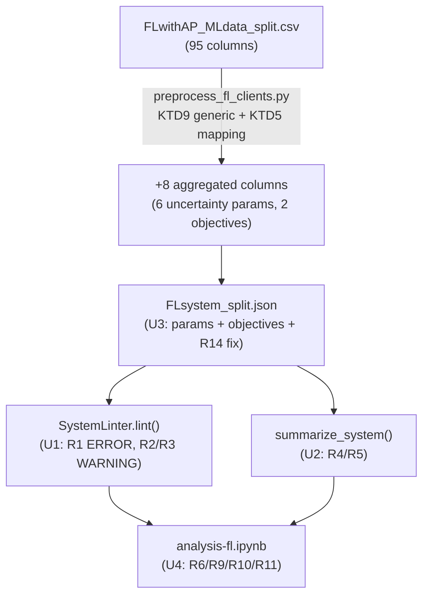

# Federated Learning ADEPT Support - Plan

## Goal Capsule

- **Objective:** Make ADEPT properly support modeling and sensitivity-analyzing
  federated-learning-style systems — multiple composed pattern decisions in one
  system, optional/NaN parameters, and stronger spec checking — using the
  existing `federatedlearning/` example as the concrete first case, with the
  per-client aggregation mechanism (R7/R15) built to generalize across other
  FL-style formulations rather than hardcoded to this one dataset's shape.
- **Product authority:** This repo's own extension beyond the published ADEPT
  paper (Diaz-Pace, Trubiani, Garlan), which explicitly names federated learning
  as future work it never built. The repo owner is the product authority; no
  external stakeholder.
- **Open blockers:** None. Scope was confirmed after two rounds of revision.

---

## Product Contract

### Summary

Extend ADEPT's spec-checking and model-description tooling to handle
multi-decision systems, wire FL's unmodeled client-heterogeneity and
usage-telemetry data into the model as new parameters and objectives, and
build a real FL analysis notebook that runs the framework's full methodology
(contingency, key-parameter selection, PRIM/CART, box visualization) end to
end for the first time.

### Problem Frame

The ADEPT paper validates its 4-phase pipeline on five microservice patterns,
each with exactly one design decision and 8–14 parameters, and names federated
learning explicitly as future work it never built. This repo already has a
partial FL example (`federatedlearning/FLsystem_split.json`), but only 22 of
its dataset's 95 columns are modeled, its 3 composed pattern decisions have
never been exercised through the framework's real analysis workflow, and the
spec itself has no automated way to check whether a multi-decision
configuration is complete or how much of the design space was actually
sampled. The result: FL's own notebook/scripts run without error but never
touch feature importance, scenario discovery, or box visualization in any
meaningful way — the pipeline looks validated but isn't.

### Requirements

**Spec processing and checking**

- R1. The linter flags, as an `ERROR`, any declared configuration that does not
  reference every decision of a multi-decision component exactly once
  (whether missing or duplicated).
- R2. The linter reports, as a `WARNING`, policy-combination coverage for each
  multi-decision component — the declared configurations against the full
  cross-product of policies across its decisions — naming any undeclared
  combinations.
- R3. The linter flags, as a `WARNING`, any declared quality objective or
  parameter whose data is near-constant/low-variance, so an architect decides
  whether to keep it declared rather than the pipeline deciding upfront. This
  covers parameters as well as objectives because FL's own client-heterogeneity
  parameters (R7) are a concrete case: all 6 aggregated fields are currently
  constant or NaN-dominated across the dataset — verified directly, not one
  earlier draft's claim that `JSD` varies; `JSD`'s per-client values are NaN
  in every client simultaneously for 25 of 32 rows and a single constant
  value in the rest — and R3 is the mechanism that surfaces that rather than
  leaving it silent.
- R4. A model summary generator renders, from any validated system
  definition, a human-readable Markdown description: patterns/components,
  decisions, policies and exactly which parameters each policy binds (read
  from the policy's parameter bindings), parameters grouped by level/type/
  optional and cross-referenced against which decisions bind them,
  configuration coverage (reusing R2's computation), and declared quality
  objectives/tradeoffs.
- R5. Both the completeness/coverage checks (R1–R2) and the summary generator
  (R4) work generically on any system definition — verified against a
  single-decision pattern as the degenerate case, not only against FL.

**Federated Learning parameter analysis**

- R6. FL analyses include FL's existing policy-bound pattern parameters in
  feature-importance and scenario-discovery scoring, so all 13 existing
  pattern parameters participate instead of being silently dropped.

**Client heterogeneity and telemetry**

- R7. FL's per-client heterogeneity fields (CPU, RAM, data distribution, data
  persistence, alpha-Dirichlet, JSD, across the 5 clients) are aggregated per
  row and declared as `uncertainty` parameters, not modeled per-client.
- R8. FL's per-client usage-telemetry fields (CPU and RAM usage averages) are
  aggregated per row and declared as quality objectives; R3's low-variance
  flag, not upfront filtering, is how a low-signal one gets surfaced for
  removal.
- R15. The per-client aggregation mechanism (R7) is general across FL-style
  formulations — different client counts, different sets of per-client
  fields — not hardcoded to this dataset's 5 clients and 6 named fields; it
  detects `Client <N> <field>` columns by pattern rather than enumerating
  them by name.

**FL analysis notebook**

- R9. A new FL analysis notebook exercises the framework's real methodology
  end to end: the model summary (R4) first, tradeoff definition, per-decision
  contingency analysis for each of FL's 3 decisions, key-parameter selection
  via smart correlation, PRIM/CART scenario discovery, and box-diagnostics
  visualization.
- R10. The notebook's box-diagnostics visualization renders, on a best-effort
  basis, a box whose limits include an optional parameter's "not selected"
  state, exercising the existing N/A-hatching render path against real data.
  Each FL pattern is ON in only 5–10 of 32 rows, so PRIM/CART may not
  naturally produce a qualifying box; if the unmodified run doesn't, that is
  a reportable outcome in the notebook, not a plan failure.
- R11. The ad hoc FL test scripts are retired as the primary validation path
  once the notebook covers the same ground.

**Test coverage**

- R12. `SemanticNaNHandler`'s audit/impute/sentinel-transformation behavior
  has direct automated test coverage.
- R13. The new linter completeness/coverage checks (R1–R2) have automated
  test coverage, including a regression check that FL's spec lints clean on
  the `ERROR` checks and produces the expected coverage warning.

**Cleanup**

- R14. FL's dead column rename (mapped to an unused objective name) is
  resolved — either the objective is added or the rename is removed.

### Key Decisions

- **Spec checking and description stay as two separate utilities, not a
  unified inspector.** (session-settled: user-directed — chosen over a
  single unified module with a session-level entry point: smaller footprint,
  following the existing split between validation and description tooling,
  accepting that the coverage computation is written twice.) Governs R1, R2,
  R4.
- **FL's existing pattern parameters keep their current typing; the fix is at
  the analysis call site, not the spec.** These are policy-bound values, the
  same shape as constraint-typed parameters in the framework's own reference
  example — retyping them would miscast policy-bound values as independent
  design axes. Governs R6.
- **Client heterogeneity is modeled now, aggregated across clients rather
  than per-client.** (session-settled: user-directed — chosen over deferring
  it or leaving it out entirely: it's the most FL-specific signal in the
  dataset, and FL clients are interchangeable, so per-client identity isn't
  meaningful.) Governs R7.
- **Both usage-telemetry fields are declared as objectives; low variance is
  flagged, not pre-filtered.** (session-settled: user-directed — chosen over
  deciding upfront which telemetry columns become objectives based on a
  one-time variance check: the general policy reuses the spec-checking work
  instead of baking a one-off judgment into this plan.) Governs R3, R8.
- **The policy-combination coverage warning stays permanent and
  unsuppressable.** (session-settled: user-directed — chosen over adding a
  spec-level acknowledgment field to silence it: it only ever fires on
  multi-decision components, and staying visible is the point — it documents
  a real, otherwise-invisible gap in experiment design.) Governs R2.
- **A real analysis notebook replaces the ad hoc test scripts as primary
  validation.** (session-settled: user-directed — chosen over only patching
  the existing scripts: it's the only way to actually exercise the
  framework's methodology, including scenario discovery and box
  visualization, against FL data.) Governs R9, R10, R11.

### Acceptance Examples

- AE1. **Covers R1.** Given a component with 2 decisions and a configuration
  referencing only 1 of them, when the linter runs, then it reports an
  `ERROR` naming the missing decision.
- AE2. **Covers R1.** Given a configuration with two references to the same
  component/decision pair, when the linter runs, then it reports an `ERROR`
  for the duplicate.
- AE3. **Covers R2.** Given FL's spec (3 binary decisions, 4 of 8
  combinations declared), when the linter runs, then it reports a `WARNING`
  naming exactly the 4 undeclared combinations.
- AE4. **Covers R3, R8.** Given the aggregated `RAM Usage Avg Mean` objective
  (78% of its 32 row-level values identical, verified against the real
  aggregate, not raw per-client values), when the linter runs, then it
  reports a `WARNING` flagging it as low-variance; the objective stays
  declared unless an architect removes it.
- AE5. **Covers R5.** Given a single-decision pattern's spec, when the
  linter's coverage check runs, then it reports no coverage warning (1 of 1
  combination trivially satisfied).
- AE6. **Covers R9, R10.** Given the FL notebook run end to end, when
  PRIM/CART discovers a box whose limits include an optional parameter's
  "not selected" state, then the box-diagnostics visualization renders that
  parameter with visible N/A hatching.

### Scope Boundaries

**Deferred for later**

- Additional scenario-discovery algorithms (e.g. Bayesian rule lists,
  explainable boosting machines) and an LLM-based explanation layer — the
  ADEPT paper's own named future work, not part of this plan.
- Joint/N-way decision-combination analysis (crossing 2+ decisions at once)
  — FL's data is one-factor-at-a-time sampled (4 of 8 combinations), so
  there is nothing to build or verify such an analysis against yet.
- Collecting more FL experiment data — a real limitation on how trustworthy
  discovered boxes will be (FL has far fewer sampled rows per parameter than
  the paper's own single-decision patterns), but outside this plan's control.

**Outside this plan**

- Retyping FL's existing pattern parameters — rejected in favor of the
  call-site fix (see Key Decisions).
- A spec-level acknowledgment mechanism to suppress the coverage warning —
  rejected in favor of leaving it permanent (see Key Decisions).
- A fully generic "aggregate any per-entity columns for any ADEPT pattern"
  utility — out of scope. R15 generalizes across FL-shaped variations
  (per-client columns following a `Client <N> <field>` naming convention),
  not across arbitrary pattern structures unrelated to per-client data.

### Dependencies / Assumptions

- Assumes the FL dataset (`federatedlearning/FLwithAP_MLdata_split.csv`)
  stays the canonical source; no new data collection is part of this plan.
- Assumes the conda environment already used to run this repo's notebooks
  and tests remains the way to execute the new notebook and test suite.

### Sources / Research

- ADEPT paper: Diaz-Pace, Trubiani, Garlan, "ADEPT: A Framework for Automated
  Data-driven Understanding of Design Decisions in Pattern-based Microservices
  Architectures" (JSS submission) — 4-phase pipeline, Table 2 concept
  definitions, §8 names federated learning as future work and cites
  Compagnucci/Pinciroli/Trubiani, "Experimenting architectural patterns in
  federated learning systems," JSS 232, 112655, 2026, as the likely source of
  FL's Client Selector / Message Compressor / HDH patterns.
- `adept/core/models.py`: `ArchitecturalPattern.decisions: Dict[str, Decision]`
  already supports multiple decisions per component.
- `adept/utils/linter.py:113-174` (`_validate_configuration_references`):
  checks individual policy references resolve, but has no completeness or
  coverage check today — the gap R1–R2 close.
- `adept/core/session.py:2339`: `compute_feature_scores()` defaults
  `include_constraints=False`, the root cause R6 addresses.
- `adept/utils/nan_handler.py`: `SemanticNaNHandler.apply_sentinel_transformation`
  already branches numeric vs. categorical optional parameters; no dedicated
  test file exists for it (the gap R12 closes).
- `patterns/Gateway_Offloading/analysis-go.ipynb`: the existing notebook that
  demonstrates the full intended workflow (contingency, smart-correlation
  key-parameter selection, per-tradeoff PRIM/CART) that R9 replicates for FL.
- `federatedlearning/FLsystem_split.json`: confirmed via script — 3 binary
  decisions give 8 theoretical policy combinations, 4 declared/observed.
- Per-client telemetry variance check (this session): the aggregated `CPU
  Usage Avg Mean` ranges 109–153.4 across 32 rows (real signal); the
  aggregated `RAM Usage Avg Mean` is 78% concentrated at exactly 2.0
  (near-constant) — the concrete case R3/AE4 exercises today. All 6
  aggregated client-heterogeneity fields (R7) are constant or NaN-dominated
  on the current dataset — verified directly by aggregating the raw CSV,
  including `JSD`, which an earlier draft of this plan incorrectly described
  as the one varying field.

---

## Planning Contract

**Product Contract preservation:** unchanged since the `ce-doc-review` pass —
R1–R14, Key Decisions, and Acceptance Examples carry forward as-is. This
enrichment only adds the sections below.

### Key Technical Decisions

- **KTD1. Linter extension lands in `adept/utils/linter.py`** as new private
  methods called from `lint()`; no new module for checking. (session-settled:
  user-approved — the file placement was proposed and the user confirmed
  proceeding with the plan as scoped.) Governs R1, R2, R3.
- **KTD2. Model summary generator lands in a new `adept/utils/spec_summary.py`**
  exposing `summarize_system(sys_def) -> str`; no session-level entry point.
  (session-settled: user-approved — matches the Product Contract's "two
  separate utilities" Key Decision; no `session.describe_model()` method is
  added.) Governs R4.
- **KTD3. R6 needs no production code change.** `compute_feature_scores()`
  already accepts `include_constraints`; the FL notebook (U4) calls it with
  `include_constraints=True`. R6 itself is satisfied entirely by correct
  notebook usage. Governs R6. (This does not cover KTD8's fix — a separate,
  pre-existing bug on the scenario-discovery path U4 also calls.)
- **KTD8. Fix `adept/core/session.py`'s `_discover_single_prim`
  `analyzer_fi` bug as in-scope, not a pre-existing issue to work around.**
  The method assigns `analyzer = FeatureImportanceAnalyzer(...)` but its
  `standardize` branch reads the undefined name `analyzer_fi` — confirmed by
  reading the method directly (`adept/core/session.py:2714-2754`). This is
  exactly the call shape U4's notebook uses
  (`discover_scenarios(..., standardize=True)`), so left unfixed it raises a
  `NameError` before any PRIM box is computed. One-line rename
  (`analyzer_fi` → `analyzer` at the `preprocess_features` call), pre-existing
  and unrelated to any other unit's scope, but blocking for U4. Governs R9,
  R10.
- **KTD4. Client-heterogeneity aggregation is a `session.load(preprocessor=...)`
  hook**, not a core loader change — mirrors
  `patterns/Gateway_Offloading/analysis-go.ipynb`'s `preprocess_gateway_offloading`.
  Governs R7.
- **KTD9. The per-client aggregator auto-detects `Client <N> <field>`
  columns by naming pattern**, not a hardcoded client count or field list —
  aggregating each detected field by dtype (numeric → mean, categorical →
  distinct-value count, the same two strategies KTD5 chose, now applied
  generically instead of enumerated per-field). A separate, small, explicit
  mapping still decides which detected fields become `uncertainty`
  parameters (heterogeneity, R7) versus `quality_objectives` (telemetry,
  R8) — dtype alone can't distinguish an input condition from a measured
  outcome (e.g. `CPU` and `CPU Usage Avg` are both numeric), so that role
  assignment stays explicit, not inferred; a different FL formulation
  supplies its own mapping, while the detection/aggregation mechanism is
  unchanged. Governs R7, R8, R15.
- **KTD5. Aggregation statistics: mean only**, not mean+standard-deviation,
  per field for the 4 numeric heterogeneity fields (CPU, RAM, Alpha
  Dirichlet, JSD); a distinct-value count across the 5 clients for the 2
  categorical fields (Data Distribution, Data Persistence) — 6 aggregated
  heterogeneity parameters total. Mean-only was chosen over mean+std because,
  on the current dataset, per-client values are fixed by client index across
  every row (verified directly), so a standard-deviation column would be a
  second constant derived from the same constant inputs — added complexity
  with no additional signal today. `Client JSD Mean` is declared
  `optional: true` (both on the parameter and in `metadata.nan_features.
  optional_parameters`): unlike the other 3 numeric fields, `JSD` is
  genuinely absent — all 5 per-client `JSD` values are NaN together in 25 of
  the 32 rows (whenever `hdh_pattern` is OFF) — so without the `optional`
  flag, `session.load()`'s unconditional zero-fill for non-optional numeric
  parameters would silently encode "pattern inactive" as a fabricated `JSD =
  0.0` ("identical distributions") instead of routing it through
  `SemanticNaNHandler`'s existing sentinel path. Governs R7.
- **KTD6. Telemetry objectives use the same mean aggregation** as KTD5's
  numeric fields, declared unconditionally — R3's low-variance check (U1) is
  what flags `RAM Usage Avg`, not manual pre-filtering. Governs R8.
- **KTD7. R14 resolves by adding `final_val_f1` as a 6th quality objective**,
  not by dropping the rename — keeps data the FL experiments already compute
  (Final Val F1, Last Round) rather than discarding it, consistent with R3/R8's
  "declare and let the variance check filter" philosophy. Governs R14.

### High-Level Technical Design

The linter (U1) and the summary generator (U2) both read the same
`SystemDefinition` and both compute policy-combination coverage
independently (KTD1's accepted duplication) before the notebook (U4)
consumes the corrected JSON (U3) and the two utilities' output.

---

## Implementation Units

### U1. Linter: multi-decision completeness, coverage, and low-variance checks

- **Goal:** Implement R1 (completeness `ERROR`), R2 (coverage `WARNING`), and
  R3 (low-variance `WARNING` for objectives and parameters) in `SystemLinter`.
- **Requirements:** R1, R2, R3, R5. Cites KTD1.
- **Dependencies:** none.
- **Files:** `adept/utils/linter.py`.
- **Approach:**
  - Add `_validate_multi_decision_completeness(sys_def)`, called from `lint()`
    after `_validate_configuration_references`. For every component with more
    than one decision, verify each declared configuration's
    `pattern_policy_references` covers every decision exactly once. `ERROR`
    on a missing decision reference; `ERROR` on a duplicate `(component,
    decision)` reference. Covers AE1, AE2.
  - Add `_validate_policy_combination_coverage(sys_def)`. For each
    multi-decision component, compute the cross-product of policies across
    its decisions, diff against the declared configurations' decision→policy
    tuples, and `WARNING` naming the missing combinations. A single-decision
    component's cross-product is trivially 1-of-1, so it never fires. Covers
    AE3, AE5.
  - Add `_validate_low_variance(sys_def, df)`, extending the existing
    `_validate_objectives`-style pattern to also cover declared parameters:
    for each declared quality objective and parameter, compute the most-common-
    value concentration on the loaded DataFrame and `WARNING` when it meets or
    exceeds a module-level constant `LOW_VARIANCE_THRESHOLD = 0.70` (documented
    as calibrated against the observed 78%-concentrated `RAM Usage Avg Mean`
    case, not derived from broader analysis — a future pattern may need a
    different cutoff). Covers AE4.
  - `lint()` already receives `(sys_def, df)`; no signature change.
- **Patterns to follow:** `_validate_configuration_references` (component/
  decision/policy resolution) and `_validate_objectives` (df-column
  existence check) as style templates.
- **Test scenarios:** written in U5 (Test coverage), citing AE1–AE5.
- **Verification:** `pytest -q --ignore=legacy tests/test_linter.py` passes
  with the new cases; `lint()` against `federatedlearning/FLsystem_split.json`
  produces exactly one coverage `WARNING` (4 of 8) and zero completeness
  `ERROR`s; `lint()` against `patterns/CQRS/CQRS.json` produces zero
  completeness/coverage findings.

### U2. Model spec summary generator

- **Goal:** Implement R4 and R5 — a new `adept/utils/spec_summary.py`.
- **Requirements:** R4, R5. Cites KTD2.
- **Dependencies:** none (mirrors U1's coverage computation per KTD1, without
  importing it, per the Key Decision's accepted duplication).
- **Files:** `adept/utils/spec_summary.py` (new).
- **Approach:**
  - `summarize_system(sys_def: SystemDefinition) -> str` returning Markdown.
  - Render, in order: each component's decisions and policies with exactly
    which parameters and values each policy's `parameter_bindings` sets;
    parameters grouped by level/type/optional and cross-referenced against
    which decisions/policies bind them, versus free-standing levers/
    uncertainties no policy touches; configuration coverage (same computation
    as U1's `_validate_policy_combination_coverage`, independently written);
    declared quality objectives and tradeoffs.
  - A plain callable is sufficient scope for R4 — no CLI wrapper.
- **Patterns to follow:** `adept/utils/linter.py`'s `SystemDefinition`
  traversal style.
- **Verification:** run `summarize_system()` against
  `patterns/CQRS/CQRS.json` (single decision — no coverage-warning-equivalent
  line) and `federatedlearning/FLsystem_split.json` (three decisions —
  reports 4-of-8 coverage); confirm at least one FL policy's parameter
  bindings (e.g. `hdh_pattern` `ON`) render correctly.

### U3. Generic per-client aggregator, FL parameter/objective wiring, and JSON cleanup

- **Goal:** Implement R7, R8, R15, R14 — a per-client column aggregator
  general across FL-style formulations (not hardcoded to this dataset's
  shape), FL's own parameter/objective declarations built on top of it, and
  the dead-rename cleanup.
- **Requirements:** R7, R8, R15, R14. Cites KTD4, KTD5, KTD6, KTD7, KTD9.
- **Dependencies:** none.
- **Files:** `federatedlearning/preprocess_fl_clients.py` (new),
  `federatedlearning/test_preprocess_fl_clients.py` (new),
  `federatedlearning/FLsystem_split.json`.
- **Approach:**
  1. `preprocess_fl_clients.py` — `aggregate_per_client_columns(df)`:
     detects columns matching `Client <N> <field>` by regex (no hardcoded
     client count or field list), groups by `<field>`, and aggregates each
     group across however many client indices are present — numeric fields
     via `.mean(axis=1, skipna=True)` into a new `<field> Mean` column,
     non-numeric fields via `.nunique(axis=1)` into `<field> Diversity`
     (KTD9). Run against this dataset it produces the same 8 columns U3
     always targeted (4 numeric means, 2 diversity counts, 2 telemetry
     means), but the function itself names none of `CPU`, `RAM`, `Alpha
     Dirichlet`, `JSD`, `Data Distribution`, `Data Persistence`, `CPU Usage
     Avg`, `RAM Usage Avg`, or `5` — a differently-shaped FL variation (more
     clients, a different field set) reuses it unmodified.
  2. A small, explicit `FIELD_ROLES` mapping in the same file (not inferred
     from dtype or name) lists which aggregated fields are heterogeneity
     parameters (`CPU`, `RAM`, `Alpha Dirichlet`, `JSD`, `Data Distribution`,
     `Data Persistence`) versus telemetry objectives (`CPU Usage Avg`, `RAM
     Usage Avg`) — this mapping is specific to this FL formulation; a
     different one supplies its own, while step 1's mechanism doesn't
     change (KTD9). Pass this mapping to `session.load(preprocessor=...)`.
  3. `FLsystem_split.json`: declare the 6 aggregated heterogeneity columns
     (4 means + 2 diversity counts) as `uncertainty`-typed parameters under
     `fl_system.parameters` (matching the reference example's
     `deviceCPUCycles` convention, no `distribution` block needed);
     additionally mark `Client JSD Mean` `optional: true` on its parameter
     declaration and add it to `metadata.nan_features.optional_parameters`,
     per KTD5. Declare the 2 telemetry-mean columns plus `final_val_f1` as 3
     new `quality_objectives` (R8, KTD7), extending `column_renames` for
     `final_val_f1`'s source column if not already mapped.
- **Patterns to follow:**
  `patterns/Gateway_Offloading/analysis-go.ipynb`'s
  `preprocess_gateway_offloading` (preprocessor shape);
  `docs/json_new_input_format_example.json`'s `deviceCPUCycles` (uncertainty
  parameter declaration).
- **Test scenarios:**
  - Happy path: `aggregate_per_client_columns` run against the real FL CSV
    produces exactly the 8 documented columns.
  - Generality: `Covers R15.` Run against a small synthetic DataFrame with a
    different client count (e.g. 3 clients) and a field name that appears
    nowhere in the real FL dataset (one numeric, one categorical) — the
    function detects and aggregates them correctly into `<field> Mean`/
    `<field> Diversity` columns, proving it doesn't hardcode `5` or any of
    this dataset's field names.
  - Edge case: a DataFrame with zero `Client <N> <field>` columns (e.g.
    CQRS-shaped data) is a no-op — the aggregator returns the DataFrame
    unchanged rather than raising.
- **Verification:** `pytest -q --ignore=legacy
  federatedlearning/test_preprocess_fl_clients.py` passes; `session.load(
  preprocessor=...)` on `FLsystem_split.json` produces exactly the 8 new
  columns with no `KeyError`; `Client JSD Mean` reaches the
  sentinel-transformation path (not a silent zero-fill) for the 25 rows
  where it's NaN; U1's linter flags all 6 aggregated heterogeneity
  parameters with the low-variance `WARNING` when run against the loaded
  DataFrame.

### U4. FL analysis notebook

- **Goal:** Implement R6 (via correct call-site usage), R9, R10, R11; fix the
  pre-existing `analyzer_fi` bug (KTD8) this unit's own notebook triggers.
- **Requirements:** R6, R9, R10, R11. Cites KTD3, KTD8.
- **Dependencies:** U1, U2, U3.
- **Files:** `federatedlearning/analysis-fl.ipynb` (new),
  `adept/core/session.py` (one-line fix, KTD8).
- **Approach:**
  1. Fix `adept/core/session.py:2751` first: in `_discover_single_prim`'s
     `standardize` branch, rename `analyzer_fi` to `analyzer` (the actual
     local `FeatureImportanceAnalyzer` instance from line 2722) so
     `discover_scenarios(..., standardize=True)` doesn't raise `NameError`
     before this unit's own steps 6-7 can run.
  2. Print `summarize_system(sys_def)` (U2) as the opening cell.
  3. `session = PatternAnalysis('./FLsystem_split.json');
     session.load(preprocessor=...)` (U3).
  4. Run `SystemLinter().lint(session.sys_def, session.experiments_df)` (U1)
     as an explicit sanity-check cell and print any findings before
     proceeding — the notebook shouldn't build analysis on a spec the linter
     would flag.
  5. `session.create_tradeoffs(method='discretization', n_bins=3)`.
  6. For each of FL's 3 decisions: `show_policy_contingency(decision_key,
     ...)`, `get_deterministic_policies()`, `get_exclusive_tradeoffs()`.
  7. `session.compute_feature_scores(use_smart_correlation=True,
     include_constraints=True, subset='train')` — the R6/KTD3 call site —
     then `get_weighted_feature_ranking()` / `select_top_k_parameters()`.
     Assert all 13 of FL's existing pattern parameters appear in the ranking
     output, so a future edit that reintroduces the `include_constraints`
     regression fails `nbconvert --execute` instead of passing silently.
  8. `session.discover_scenarios(tradeoff.name, method='prim',
     parameters=key_parameters, standardize=True)` per tradeoff, and the CART
     equivalent (no extra argument needed for `include_constraints`, per
     KTD3; needs step 1's fix to run at all).
  9. `session.show_box_diagnostics(box=...)` on the first non-empty box, best
     effort per R10 — if no discovered box touches an optional parameter's
     NA state, the notebook prints that outcome explicitly instead of
     asserting one exists.
  10. Closing markdown cell stating that `federatedlearning/test_manual_simple.py`,
      `test_nan_feature.ipynb`, and root `test_nan_manual.py` are no longer
      the canonical validation path (R11) — the files stay in place, not
      deleted, per R11's "retired" wording.
- **Patterns to follow:** `patterns/Gateway_Offloading/analysis-go.ipynb`
  (the whole structure).
- **Test scenarios:**
  - Happy path: full notebook executes via `jupyter nbconvert --to notebook
    --execute` with no cell errors.
  - Regression: `Covers KTD8.` `discover_scenarios(method='prim',
    standardize=True)` no longer raises `NameError: name 'analyzer_fi' is
    not defined` — this is the specific failure mode step 1's fix addresses,
    confirmed by the notebook reaching step 9 (box diagnostics) at all.
  - Edge case: `Covers R10.` If the unmodified PRIM/CART run produces zero
    boxes touching an optional parameter's NA state, the notebook prints
    that outcome rather than failing or asserting one exists.
  - Integration: `Covers R6.` `compute_feature_scores(include_constraints=True)`
    output includes all 13 of FL's existing pattern parameters, not only the
    5 generic system-level levers; the step-7 assertion enforces this on
    every run, not just this one.
- **Verification:** `jupyter nbconvert --to notebook --execute
  federatedlearning/analysis-fl.ipynb` (in the `perfmodels` conda env)
  completes with no raised exceptions, including no `NameError` from the
  scenario-discovery step; the linter sanity-check cell (step 4) reports the
  same findings as U1's own verification; feature-importance output includes
  all 13 pattern parameters (asserted, not just printed); a cell's output
  states whether R10's best-effort box was found.

### U5. Test coverage for `SemanticNaNHandler` and linter checks

- **Goal:** Implement R12, R13.
- **Requirements:** R12, R13. Cites KTD1.
- **Dependencies:** U1 required only for the `tests/test_linter.py` additions
  (R13); `tests/test_nan_handler.py` (R12) tests the pre-existing, unmodified
  `SemanticNaNHandler` and has no dependency on U1 — it can start immediately.
- **Files:** `tests/test_nan_handler.py` (new), `tests/test_linter.py`
  (extend).
- **Approach:**
  - `tests/test_nan_handler.py`: unit tests for
    `adept/utils/nan_handler.py`'s `SemanticNaNHandler` —
    `audit_nan_proportions` (overall and per-column percentages on a small
    synthetic DataFrame); `impute_outcomes` (`worst_case` ×
    `maximize`/`minimize`, `fixed_value`, `drop` as a no-op); 
    `apply_sentinel_transformation` (numeric optional column → sentinel below
    minimum; non-numeric optional column → binary presence flag; a
    non-optional column with NaNs left untouched).
  - `tests/test_linter.py` additions: a synthetic 2-decision component
    fixture with (a) a configuration missing one decision reference (`ERROR`,
    covers AE1), (b) a configuration with a duplicate `(component, decision)`
    reference (`ERROR`, covers AE2), (c) partial policy-combination coverage
    (`WARNING` naming the right missing combinations, covers AE3-shape), (d)
    a single-decision fixture (no coverage `WARNING`, covers AE5); plus a
    regression case loading `federatedlearning/FLsystem_split.json` directly
    and asserting it lints clean on `ERROR`s with exactly the 4-of-8 coverage
    `WARNING` (covers AE3).
- **Patterns to follow:** `tests/test_linter.py`'s existing fixture style;
  `tests/test_loader.py` for synthetic `SystemDefinition` construction.
- **Test scenarios:**
  - Happy path: `SemanticNaNHandler` methods produce correct output on
    well-formed synthetic data.
  - Edge cases: empty DataFrame to `audit_nan_proportions`; a column with
    zero NaNs (no-op for `impute_outcomes`/`apply_sentinel_transformation`);
    a fully-NaN optional column.
  - Error/failure paths: `Test expectation: none -- SemanticNaNHandler has no
    raising branches in its current implementation.`
  - Integration: `Covers AE3.` `FLsystem_split.json`'s real 4-of-8 coverage
    `WARNING` reproduced end to end through `SystemLinter.lint()`, not only
    via synthetic fixtures.
- **Verification:** `pytest -q --ignore=legacy tests/test_nan_handler.py
  tests/test_linter.py` passes; the full `pytest -q --ignore=legacy` run
  shows the same 2 pre-existing unrelated failures in `test_data_processor.py`
  and no new failures.

---

## Verification Contract

| Command | Applies to | Gate |
|---|---|---|
| `pytest -q --ignore=legacy` | All units | No new failures beyond the 2 pre-existing `test_data_processor.py` ones (`test_pareto_epsilon`, `test_static_threshold`) |
| `jupyter nbconvert --to notebook --execute federatedlearning/analysis-fl.ipynb` (in the `perfmodels` conda env) | U4 | Completes with no raised exceptions |
| `summarize_system()` run against `patterns/CQRS/CQRS.json` and `federatedlearning/FLsystem_split.json` | U2 | Valid Markdown; CQRS shows no coverage line, FL shows 4-of-8 |
| `SystemLinter.lint()` run against the same two specs | U1 | CQRS: zero findings. FL: zero `ERROR`s, one coverage `WARNING`, low-variance `WARNING`s on all 6 aggregated heterogeneity parameters |

`--ignore=legacy` is required because the bare `pytest -q` fails on
pre-existing, unrelated `legacy/tests` import errors (confirmed this
session); this is not something this plan fixes.

## Definition of Done

- All 15 requirements (R1–R15) are satisfied and traceable to an
  implementation unit.
- R15's generality claim is demonstrated by a passing test
  (`federatedlearning/test_preprocess_fl_clients.py`) against a synthetically
  differently-shaped example, not only this session's real FL dataset.
- KTD8's `analyzer_fi` fix has landed in `adept/core/session.py`, and
  `discover_scenarios(method='prim', standardize=True)` no longer raises
  `NameError`.
- `pytest -q --ignore=legacy` passes with no new failures.
- `federatedlearning/analysis-fl.ipynb` executes end to end with no raised
  exceptions in the `perfmodels` conda environment.
- `SystemLinter.lint()` against both `patterns/CQRS/CQRS.json` and
  `federatedlearning/FLsystem_split.json` produces the documented,
  verified output.
- No dead-end or experimental code remains from approaches that didn't pan
  out. The old FL scripts (`test_manual_simple.py`, `test_nan_feature.ipynb`,
  root `test_nan_manual.py`) remain in place, per R11 — "retired" means
  no longer canonical, not deleted.
