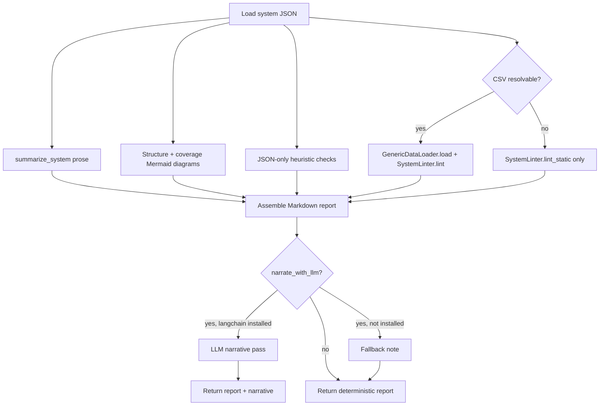

# Design Space Report Generator - Plan

## Goal Capsule

- **Objective:** Add a Python utility that reads any ADEPT system-definition
  JSON and renders a standalone Markdown report of the modeled design space —
  components, decisions, policies, parameters, Mermaid diagrams of the
  pattern/decision/policy structure, and a set of JSON-only "double-check
  this" flags — so an architect can sanity-check the spec before wiring it to
  a results CSV and running sensitivity analysis.
- **Product authority:** This repo's own extension of the ADEPT framework's
  tooling. The repo owner is the product authority; no external stakeholder.
- **Open blockers:** None.

---

## Product Contract

### Summary

A new module, `adept/utils/design_space_report.py`, exposes
`generate_design_space_report(sys_def, df=None, preprocessor=None,
narrate_with_llm=False) -> str`. It reuses `spec_summary.summarize_system`
for the prose description and `SystemLinter` for both JSON-only structural
checks (always) and data-aware checks (whenever a results CSV can be
resolved), adds two Mermaid diagrams, and flags JSON-only spec smells the
linter doesn't already cover. An optional, off-by-default LLM narration
layer turns the findings into plainer prose without ever generating the
diagrams or facts itself. A bare `sys.argv`-based CLI entrypoint, matching
`federatedlearning/preprocess_csv.py`'s existing style, makes it runnable as
a script.

### Problem Frame

ADEPT system JSONs (`federatedlearning/FLsystem_split.json`,
`patterns/*/*.json`) are hand-authored and can silently drift into
inconsistent shapes — a decision with only one real policy, a parameter
missing `bounds`, a constraint bound in every policy despite being marked
optional — before anyone runs a single simulation or has a results CSV to
check against. `SystemLinter` already catches spec-vs-data mismatches, but
only once a CSV exists; `spec_summary.summarize_system` already renders a
prose description, but has no visual diagrams and no opinion on whether the
spec itself looks off. Neither tool is meant to be a pre-flight, human-facing
sanity check run before any data exists.

### Requirements

- R1. Given any ADEPT system-definition JSON, `generate_design_space_report`
  renders a self-contained Markdown report covering components, decisions,
  policies, and parameters, usable before any results CSV exists.
- R2. The report includes a Mermaid diagram of the pattern/decision/policy
  structure for every component.
- R3. For every component with 2+ decisions, the report includes a Mermaid
  diagram distinguishing declared vs. missing policy combinations (reusing
  `spec_summary`'s existing coverage computation).
- R4. The report flags JSON-only structural smells — a decision with exactly
  one policy, a parameter binding held constant across every policy of a
  decision, a lever/uncertainty parameter with no `bounds`, and an optional
  constraint bound in every policy of its decision (or a non-optional
  constraint bound in only some) — as advisory items, visually distinct from
  `SystemLinter`'s ERROR/WARNING issues.
- R5. JSON-only `SystemLinter` checks (tradeoff validity, configuration
  references) always run. Data-aware `SystemLinter` checks run automatically
  whenever a CSV resolves via `dataspace.source_file` (or an explicit
  override path), without requiring the CSV to exist and without raising
  when it's absent.
- R6. `narrate_with_llm=True` attempts an LLM narration pass (e.g. via
  LangChain) over the deterministic findings; when the dependency isn't
  installed, it falls back to the deterministic report plus a one-line note
  instead of raising. The LLM is never used to generate diagrams or
  structural facts.
- R7. The tool runs without crashing against every existing example system
  JSON in the repo (`federatedlearning/FLsystem_split.json`,
  `federatedlearning/FLsystem.json`, and the six per-pattern system-definition
  files: `patterns/Anti_Corruption_Layer/Anti_Corruption_Layer.json`,
  `patterns/Backends_for_Frontends/BackendForFrontends.json`,
  `patterns/CQRS/CQRS.json`,
  `patterns/Gateway_Aggregation/Gateway_Aggregation.json`,
  `patterns/Gateway_Offloading/Gateway_Offloading.json`,
  `patterns/Pipes_and_Filters/PipesAndFilters.json` — excluding the
  `cart_boxes-*`/`prim_boxes-*` box-result files that sit alongside them in
  the same directories), not just the FL split system it was designed
  against.

- R8. *(Proposed 2026-09-30, pending approval.)* The report includes a
  **conceptual-model instance diagram**: the ADEPT conceptual model
  (`docs/paper_adept_formal_extension.md` §1.1) instantiated for the given
  spec, like the FL example in §1.2 of that document. The **JSON-only part**
  is always rendered:
  - system, components, decisions and policies, with bindings shown as counts
    per KTD5;
  - parameters grouped by role, with their `optional` flag;
  - aggregations and the parameters/objectives they derive;
  - objectives with their direction and missing-outcome treatment;
  - declared vs. observed configurations (from R3).

  With a CSV (R5), parameter domains (numeric/categorical) are added. With an
  analysis session (optional input), tradeoffs and the discovered boxes with
  their conditions and readings are also added. This part is out of scope for
  v1 unless approved.

### Key Decisions

- **Reuse `SystemLinter` and `summarize_system` rather than reimplementing
  them** (session-settled: user-directed — chosen over building an
  independent module with its own JSON-traversal logic: keeps one owner per
  check, avoids the two tools drifting apart). Governs R1, R3, R4, R5.
- **CSV usage is optional and best-effort, never required** (session-settled:
  user-directed — chosen over a strictly JSON-only tool: lets the report get
  richer once data exists without changing its pre-flight purpose). Governs
  R5.
- **LLM narration is additive-only, off by default, and never authoritative
  over the diagrams or facts** (session-settled: user-approved — chosen over
  a more central LLM role such as drafting the diagram descriptions or
  judging which assumptions matter, to keep the report's structural claims
  deterministic and reproducible). Governs R6.

### Scope Boundaries

- Deferred: exact LLM provider, model, and prompt design for the narration
  layer — the interface and safe fallback are specified now; the call itself
  is an implementation-time choice.
- Deferred: an HTML or interactive version of the report.
- Out of scope: auto-fixing a flagged spec issue. The tool only flags.
- Out of scope: a second, independent implementation of `SystemLinter`'s
  checks. Every check this tool needs either already exists in `linter.py`
  or is added there once, not duplicated.

### Risks & Dependencies

- CSV-aware validation quality depends on whether a system needs a
  preprocessor hook (e.g. FL's `preprocess_fl_clients.preprocess_fl`) to
  produce columns matching its declared parameter/objective names. The tool
  accepts an optional `preprocessor` callable (same shape as
  `GenericDataLoader.load`'s hook) but cannot auto-select one, so a raw,
  un-preprocessed FL CSV will under-report real objectives/parameters as
  "missing." This is an existing limitation of column-name-based linting,
  not something this plan resolves generically — document it, don't solve
  it.
- `langchain` (or any LLM SDK) is not currently a dependency anywhere in this
  repo (confirmed by repo-wide grep). Adding the optional narration layer
  introduces a genuinely new, optional dependency — document it in
  `DEPENDENCIES.md`'s existing "optional" convention, not `requirements.txt`.
- Two existing private helpers (`SystemLinter`'s JSON-only checks,
  `spec_summary`'s coverage computation) need small public seams (U1) before
  this tool can reuse them without reaching into `_`-prefixed internals.

### Sources / Research

- `adept/core/models.py` — `SystemDefinition`/`System`/`ArchitecturalPattern`/
  `Decision`/`PatternPolicy`/`Parameter` schema.
- `adept/utils/spec_summary.py` — `summarize_system`; private
  `_compute_coverage`/`_collect_component_bindings` compute exactly the
  coverage data needed for R3.
- `adept/utils/linter.py` — `SystemLinter.lint`; `_validate_tradeoffs` (L124)
  and `_validate_configuration_references` (L145) need no `df`;
  `_validate_objectives` (L74), `_validate_parameters` (L85),
  `_validate_configuration_column` (L98), `_validate_low_variance` (L309) do.
- `adept/core/loader.py:283-289` — the `os.path.isabs`/
  `os.path.join(dirname(source), source_file)` idiom for resolving
  `dataspace.source_file`; `GenericDataLoader.load(source, validate_integrity,
  preprocessor)` already performs full path resolution, CSV read,
  preprocessing, renames, and binding injection — reuse this instead of
  re-deriving path resolution.
- `tests/test_spec_summary.py`, `tests/test_linter.py` — existing test style:
  flat `tests/` directory, `pytest`, inline substring/structural assertions,
  no golden-file fixtures, `REPO_ROOT = Path(__file__).resolve().parent.parent`
  anchoring for loading real system JSONs.
- `federatedlearning/preprocess_csv.py` — the repo's only precedent for a
  runnable script: bare `if __name__ == '__main__':` with positional
  `sys.argv` and hardcoded defaults, no `argparse`/`click`/`typer` anywhere
  in the repo.
- `docs/data_model.md` — existing hand-authored Mermaid `classDiagram` of this
  same model hierarchy; no code in the repo generates Mermaid programmatically
  today.
- `requirements.txt` / `DEPENDENCIES.md` — confirmed no `langchain`/`openai`/
  `anthropic` dependency exists anywhere in the repo; `DEPENDENCIES.md`
  already has a required-vs-optional convention to extend.

---

## Planning Contract

### Key Technical Decisions

- KTD1. **New module, no new CLI convention.** Place the tool at
  `adept/utils/design_space_report.py`, matching the one-file-per-utility
  granularity of `linter.py`/`spec_summary.py`, not wired into
  `adept/utils/__init__.py` (matches those files' own convention). Its
  `__main__` block takes bare positional `sys.argv` (JSON path required;
  output path, CSV override, and a literal `--llm` token optional, filtered
  out of the positional list before parsing), mirroring
  `federatedlearning/preprocess_csv.py` rather than introducing `argparse` as
  a new pattern.
- KTD2. **Expose two minimal public seams instead of reaching into private
  helpers.** Add `SystemLinter.lint_static(sys_def)` — the JSON-only subset
  of `lint()` (`_validate_tradeoffs` + `_validate_configuration_references`)
  — and a public `spec_summary.compute_policy_coverage(comp_key, comp,
  sys_def)` wrapping the existing `_compute_coverage`. Both are additive; no
  existing signature or behavior changes (U1).
- KTD3. **CSV resolution reuses `GenericDataLoader`, not a hand-rolled
  reader.** When CSV-aware mode is requested, call
  `GenericDataLoader().load(json_path, validate_integrity=False,
  preprocessor=preprocessor)` to get the fully processed dataframe (resolves
  `source_file`, applies renames and binding injection) rather than
  re-deriving path resolution. An explicit CSV override path is applied by
  passing a `sys_def.dataspace` copy (`model_copy(update=...)`) with
  `source_file` swapped before calling `load`. Catch the exception `load`
  raises on a genuinely missing file and fall back to `lint_static`-only
  mode with a note, rather than crashing.
- KTD4. **Heuristic checks are a fixed, small rule list, not a plugin
  system.** Four checks for v1 (single-policy decision; a parameter bound to
  the same value across every policy of a decision; a lever/uncertainty
  parameter with no `bounds`; an optional-flag/binding mismatch). Each
  renders as a labeled bullet (e.g. prefixed `CHECK`, never `ERROR`/`WARNING`)
  so it's never confused with a real `SystemLinter` issue. More checks can be
  added later without a redesign.
- KTD5. **Diagrams stay two-level to avoid explosion.** The structure diagram
  shows System → Component → Decision → Policy edges; a policy's bound
  parameters render as a count/label on the policy node, not as one edge per
  parameter (FL's HDH-ON policy alone binds 9 parameters). The coverage
  diagram (R3) is skipped entirely for single-decision components, mirroring
  `spec_summary`'s own skip rule.
- KTD6. **LLM narration is a lazy, isolated import.** `narrate_with_llm=True`
  imports `langchain` (and whichever provider wrapper) inside the function
  body, not at module load time; `ImportError` is caught and produces the
  deterministic report plus one fallback note. The exact LangChain call
  shape is deferred to implementation (U6).

### High-Level Technical Design



### Assumptions

- The exact LangChain LLM wrapper, prompt template, and provider/model choice
  are decided during implementation (U6) — out of scope for this plan beyond
  the interface and fallback behavior (R6, KTD6).
- No CSV fixture is assumed checked into the repo for FL's split system; U5's
  CSV-aware tests may need a small constructed in-memory dataframe rather
  than a real `FLwithAP_MLdata_split.csv` file if one isn't present.

---

## Implementation Units

### U1. Public seams on `linter.py` and `spec_summary.py`

- **Goal:** Add `SystemLinter.lint_static(sys_def)` and
  `spec_summary.compute_policy_coverage(comp_key, comp, sys_def)` as thin
  public wrappers around existing private logic, with no behavior change to
  either module's existing public API.
- **Requirements:** R3, R5 (KTD2)
- **Dependencies:** None
- **Files:** `adept/utils/linter.py`, `adept/utils/spec_summary.py`,
  `tests/test_linter.py`, `tests/test_spec_summary.py`
- **Approach:**
  1. In `linter.py`, add `lint_static(self, sys_def)` that calls exactly
     `_validate_tradeoffs(sys_def)` + `_validate_configuration_references(sys_def)`
     and returns the combined list.
  2. In `spec_summary.py`, add `compute_policy_coverage(comp_key, comp,
     sys_def)` that calls the existing `_compute_coverage` and returns its
     result unchanged (including the `None` case for single-decision
     components).
- **Test scenarios:**
  - `lint_static` on the FL split system returns the same tradeoff/reference
    issues `lint()` would return for those two categories, and nothing else.
  - `lint_static` never requires a `df` argument.
  - Existing `test_linter.py`/`test_spec_summary.py` assertions still pass
    unmodified.
  - `compute_policy_coverage` on FL's multi-decision `fl_system` component
    returns the same "4 of 8" figure already asserted in
    `test_spec_summary.py`.
  - `compute_policy_coverage` on a single-decision component returns `None`.

### U2. Core module skeleton and prose section

- **Goal:** Create `adept/utils/design_space_report.py` with
  `generate_design_space_report(sys_def, df=None, preprocessor=None,
  narrate_with_llm=False) -> str`, embedding `summarize_system(sys_def)`'s
  output as the report's descriptive section.
- **Requirements:** R1
- **Dependencies:** U1
- **Files:** `adept/utils/design_space_report.py` (new),
  `tests/test_design_space_report.py` (new)
- **Approach:**
  1. Load-and-validate happens by the caller (`SystemDefinition.from_json`
     already raises a clear Pydantic validation error on a malformed JSON;
     the CLI wrapper lets that surface rather than swallowing it).
  2. Embed `summarize_system(sys_def)`'s Markdown under its own report
     section, shifting its heading levels down by one so it nests under the
     new report's own top-level heading instead of colliding with it.
- **Test scenarios:**
  - Given `federatedlearning/FLsystem_split.json`, the report contains
    `summarize_system`'s text (verified by substring match, matching the
    existing test style).
  - Given a minimal single-component/single-decision system fixture, the
    report renders without error.
  - Given a system JSON that fails Pydantic validation, the resulting error
    is the model's own validation error, not an unrelated traceback.

### U3. Mermaid structure and coverage diagrams

- **Goal:** Implement the two diagram kinds from R2/R3 as pure string-building
  functions.
- **Requirements:** R2, R3 (KTD5)
- **Dependencies:** U1, U2
- **Files:** `adept/utils/design_space_report.py`,
  `tests/test_design_space_report.py`
- **Approach:**
  1. Structure diagram: one `flowchart TB` per system; nodes for the system,
     each component, each decision, each policy; a policy node's label
     includes its bound-parameter count rather than fanning out to every
     parameter.
  2. Coverage diagram: for each component where
     `compute_policy_coverage` (U1) returns a non-`None` result, render
     declared vs. missing combinations distinctly (e.g. different node
     styling or separate declared/missing lists in the diagram).
- **Test scenarios:**
  - Structure diagram includes one node per component/decision/policy for
    the FL split system.
  - FL's HDH-ON policy (9 bound parameters) appears as a labeled count, not
    9 edges.
  - The coverage diagram for FL's `fl_system` component shows the same
    "4 of 8" figure as the prose section.
  - A single-decision-only component produces zero coverage diagrams.
  - Output contains syntactically well-formed ` ```mermaid ` fenced blocks
    (structural check, not a full Mermaid parse).

### U4. JSON-only heuristic checks

- **Goal:** Implement the four heuristic categories from R4 (KTD4).
- **Requirements:** R4
- **Dependencies:** U2
- **Files:** `adept/utils/design_space_report.py`,
  `tests/test_design_space_report.py`
- **Approach:** Each check is a small function over `sys_def` returning zero
  or more labeled advisory bullets; combine into one "double-check this"
  report section, visually distinct from the `SystemLinter` section (U5).
- **Test scenarios:**
  - FL's `hdh_pattern`/`message_compressor_pattern` decisions do NOT
    false-positive on "constant across policies" — their OFF policy binds
    nothing, so it must not be treated as agreeing with ON's fixed values.
  - A constructed single-policy decision triggers the single-policy flag.
  - A lever/uncertainty parameter with no `bounds` (true of all of FL's
    system-level levers) triggers the missing-bounds flag against real data.
  - A constructed optional constraint bound in every policy of its decision
    triggers the optional-mismatch flag (FL's real optional parameters are
    all correctly asymmetric, so this needs a constructed fixture).

### U5. CSV-aware enrichment

- **Goal:** Resolve and load a CSV when possible; run the full
  `SystemLinter.lint`; otherwise run `lint_static` only.
- **Requirements:** R5 (KTD3)
- **Dependencies:** U1, U2
- **Files:** `adept/utils/design_space_report.py`,
  `tests/test_design_space_report.py`
- **Approach:** See KTD3 for the `GenericDataLoader.load` reuse and override
  mechanism. Render `SystemLinter` issues as their own report section,
  labeled with whether CSV-aware checks ran or only the JSON-only subset did.
- **Test scenarios:**
  - With a CSV present (real or constructed in-memory fixture) and a
    matching `preprocessor` supplied, the report includes real
    `SystemLinter` WARNING/ERROR lines.
  - With `dataspace.source_file` pointing at a path that doesn't exist, the
    report falls back to `lint_static`-only, with no exception raised.
  - An explicit CSV override path takes precedence over `source_file`.

### U6. Optional LLM narration and CLI entrypoint

- **Goal:** Implement `narrate_with_llm` (KTD6) and the `__main__` CLI
  wrapper (KTD1).
- **Requirements:** R6, R7 (CLI path)
- **Dependencies:** U2, U3, U4, U5
- **Files:** `adept/utils/design_space_report.py`, `DEPENDENCIES.md`
- **Approach:** Document `langchain` as an optional dependency in
  `DEPENDENCIES.md`'s existing required/optional convention; do not add it
  to `requirements.txt`.
- **Execution note:** The exact LangChain wrapper/prompt/provider choice is
  an implementation-time decision (see Assumptions) — the interface and
  fallback behavior are what this unit verifies.
- **Test scenarios:**
  - `narrate_with_llm=True` with `langchain` not installed returns the
    deterministic report plus the fallback note, and does not raise.
  - CLI with only a JSON path argument prints the report to stdout.
  - CLI with a second argument writes the report to that file path.
  - CLI with a `--llm` token present (in any position) sets
    `narrate_with_llm=True`.
  - CLI with a third positional argument (after JSON path and output path)
    threads it through as an explicit CSV override, consistent with KTD3's
    override mechanism.

### U7. Generalization check across existing example systems

- **Goal:** Confirm the tool works against every existing ADEPT system JSON
  in the repo, not just the FL split system it was designed against (R7).
- **Requirements:** R7
- **Dependencies:** U2, U3, U4, U5
- **Files:** `tests/test_design_space_report.py` (or a dedicated
  `tests/test_design_space_report_generalization.py`)
- **Approach:** Parametrize a test over `federatedlearning/FLsystem.json` and
  the six named per-pattern system-definition files from R7 (not a glob over
  each pattern directory, since each also holds non-system `cart_boxes-*`/
  `prim_boxes-*` result files that would fail Pydantic validation).
- **Test scenarios:**
  - Each of the 7 non-FL-split example JSONs produces a non-empty Markdown
    string without raising.
  - Each report contains at least one ` ```mermaid ` fenced block.

---

## Verification Contract

| Command | Applies to |
|---|---|
| `pytest tests/test_linter.py tests/test_spec_summary.py -v` | U1 (no regression) |
| `pytest tests/test_design_space_report.py -v` | U2-U6 |
| `pytest tests/test_design_space_report_generalization.py -v` (or the parametrized cases in the main test file) | U7 |

No CI workflow currently runs `pytest` in this repo (`.github/workflows/`
only has the OpenWiki refresh); running the above locally is the done signal.

## Definition of Done

- All Implementation Units' test scenarios pass.
- `tests/test_linter.py` and `tests/test_spec_summary.py` pass unmodified
  from before this work.
- The tool generates a non-empty report with at least one Mermaid diagram for
  every example system JSON in the repo (R7).
- `langchain` is documented as optional in `DEPENDENCIES.md` and is **not**
  added to `requirements.txt`; the tool runs with it absent.
- `adept/utils/__init__.py` is unchanged (new module stays un-exported,
  matching existing convention).
- No experimental or dead-end code from abandoned approaches remains in the
  diff.

---

## Deferred / Open Questions

### From 2026-09-30 (paper extension)

- **Conceptual-model instance diagram (R8).** Decide whether R8 joins v1:
  - *JSON-only part:* extends U3 with a third diagram kind (`flowchart LR`,
    one node per concept instance, labelled «Concept»). It reuses the data U3
    already walks, so the cost is low.
  - *Session-aware part* (tradeoffs, boxes): needs a new optional input (a
    `PatternAnalysis` session or saved boxes), which fits more naturally
    with U5 or a later version.

  The generic model and a hand-written FL instance live in
  `docs/paper_adept_formal_extension.md` §1.1-1.2, and serve as the
  expected output for a test on `FLsystem_split.json`.

### From 2026-09-18 review

- **KTD3's CSV-override mechanism cannot work with `GenericDataLoader.load()`'s actual signature** — Planning Contract, KTD3 (the CSV-resolution decision) (P0, coherence, feasibility, confidence 100)

  An implementer following KTD3 literally cannot make the override path work: it hands a modified system definition to `GenericDataLoader.load()`, but that call always re-derives its own system definition from the file path it's given, so the override is silently discarded. Pick one concrete fix before U5 (the CSV-aware enrichment unit) starts: a new loader seam that accepts a pre-built system definition, writing the override to a temporary file, or accepting tighter coupling to the loader's private helpers.

- **No enforcement path ties report-running to actual spec authoring** — Product Contract, Problem Frame / Definition of Done (P2, adversarial, confidence 75)

  The tool's whole justification is catching spec-authoring mistakes before a simulation runs, but nothing in the plan requires anyone to actually run it — a future spec edit could ship with the exact drift this tool exists to catch, and every requirement could still pass its own tests. Decide whether wiring the report into a pre-commit hook or CI check belongs in this plan's scope, or is explicitly deferred.
