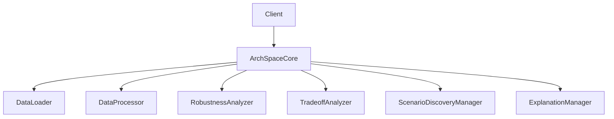
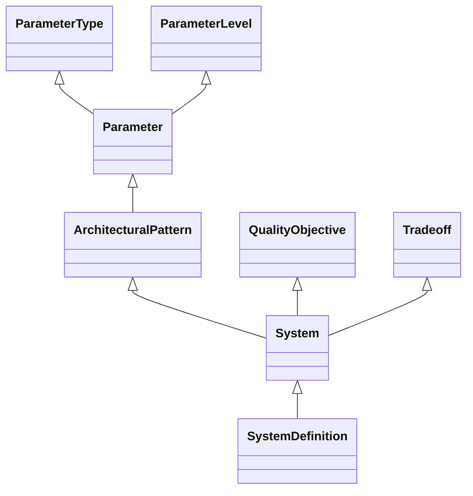

# Project Design Analysis: patterns-sa

## Executive Summary

The **patterns-sa** project is a sophisticated toolkit for performing sensitivity analysis and explainability of architectural tradeoffs on software design patterns. It has evolved from a collection of ad-hoc Jupyter notebooks to a well-structured, extensible Python framework following modern software engineering principles.

## Core Architecture

### 1. Coordinator Pattern Implementation

The project implements a **Coordinator Pattern** with `ArchSpaceCore` as the central orchestrator. This design decision provides several key benefits:

- **Separation of Concerns**: Each component has a single responsibility
- **Testability**: Components can be tested in isolation
- **Extensibility**: New functionality can be added without modifying the core
- **Dependency Injection**: Components can be easily swapped or mocked

### 2. Dual Implementation Strategy

The project maintains two parallel implementations:

1. **ADEPT Framework** (`adept/`): The newer, more sophisticated implementation
2. **ArchSpace Framework** (`archspaces/`): The original framework being refactored

This dual approach allows for gradual migration while maintaining backward compatibility.

## Key Design Decisions

### 1. Declarative Configuration

The system uses JSON-based declarative configuration (`system.json` files) to define:

- **System Components**: Architectural patterns and their parameters
- **Quality Objectives**: Performance metrics and optimization goals
- **Tradeoffs**: Named regions in outcome space
- **Policies**: Configuration strategies for pattern instances

This approach separates the architectural model from the analysis logic, making the system more flexible and maintainable.

### 2. Data-Driven Analysis

The framework assumes that performance data is generated externally (e.g., by simulators) and provided as CSV files. This decoupling allows:

- Support for multiple data sources
- Consistent analysis methodology across different datasets
- Focus on analysis rather than data generation

### 3. Strategy Pattern for Algorithms

The project implements the Strategy Pattern for:

- **Scenario Discovery**: PRIM vs. CART algorithms
- **Explanations**: Template-based vs. LLM-based explanations

This allows seamless switching between different implementations of the same functionality.

### 4. Pydantic-Based Data Models

All data structures use Pydantic models with:

- Type validation
- Field validators for data coercion
- Support for serialization/deserialization
- Clear documentation through docstrings

### 5. Categorical Analysis Approach

The framework transforms continuous metrics into categorical bins for intuitive exploration:

- **Discretization**: Continuous values → categorical labels
- **Tradeoff Analysis**: Finding similar regions in outcome space
- **Robustness Calculation**: Measuring solution space coverage

## Component Analysis

### Core Models (`adept/core/models.py`)

The model hierarchy includes:

Key model types:

- **Parameter**: Represents architectural variables with type and scope
- **ArchitecturalPattern**: Template for reusable design solutions
- **System**: Root container for architectural models
- **SystemDefinition**: Top-level declarative specification

### Coordinator Implementation

The `ArchSpaceCore` class provides high-level entry points:

- `load_data()`: Data ingestion
- `discretize()`: Categorical transformation
- `compute_robustness()`: Metric calculation
- `discover_scenarios()`: Pattern identification
- `explain()`: Natural language explanations

### Analysis Components

1. **DataProcessor**: Handles discretization and labeling
2. **RobustnessAnalyzer**: Computes architectural robustness
3. **TradeoffAnalyzer**: Explores solution space
4. **ScenarioDiscoveryManager**: Identifies parameter regions
5. **ExplanationManager**: Generates explanations

## Evolution and Migration Strategy

### Phase 1: Decomposition (Completed)

- Split monolithic `ArchSpace` into specialized components
- Implemented Coordinator Pattern
- Created separate analysis classes

### Phase 2: Declarative Loading (In Progress)

- JSON-based configuration (`system.json`)
- Generic data loader
- Strategy management for algorithms

### Phase 3: Future Enhancements

- LLM-based explanations
- Legacy pattern migration
- Visualization integration
- Enhanced schema validation

## Key Insights

1. **Modularity**: The project demonstrates excellent use of design patterns for modularity
2. **Extensibility**: New analysis methods can be added without core changes
3. **Maintainability**: Clear separation of concerns improves code quality
4. **Migration Strategy**: Gradual refactoring preserves backward compatibility
5. **Documentation**: Comprehensive design rationale documents aid understanding

## Recommendations

1. **Complete Phase 2 Migration**: Fully adopt JSON-based configuration
2. **Implement LLM Explanations**: Enhance user understanding of results
3. **Standardize Visualization**: Integrate visualization into core framework
4. **Enhance Validation**: Improve data type coercion and schema validation
5. **Document API**: Provide comprehensive API documentation for users

## Conclusion

The patterns-sa project represents a well-designed, evolving framework for architectural pattern analysis. Its thoughtful application of design patterns, clear migration strategy, and focus on extensibility make it a robust foundation for sensitivity analysis and explainability in software architecture.