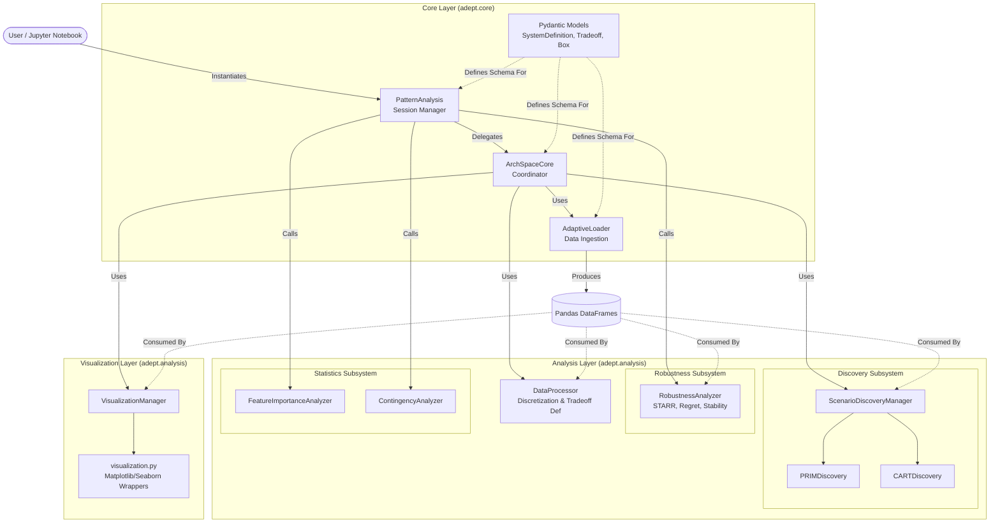

# ADEPT Software Architecture

This document visualizes the high-level software architecture of the ADEPT framework. It follows a layered architectural pattern, separating the user interface (Session) from coordination logic and specialized analytical components.

## Architecture Diagram

## Component Descriptions

### Core Layer
*   **PatternAnalysis (Session)**: The primary entry point for users. It manages the analysis lifecycle, holding state (loaded data, defined tradeoffs, split indices) and providing high-level methods for the "Analysis Journey".
*   **ArchSpaceCore (Coordinator)**: The internal orchestrator. It decouples the Session from the specific implementations of loaders and analyzers, ensuring a clean separation of concerns.
*   **AdaptiveLoader**: Handles the complexity of loading `system.json` definitions and parsing raw simulation CSVs into structured Pandas DataFrames.
*   **Models**: A centralized registry of Pydantic models (e.g., `System`, `Tradeoff`, `Box`) that enforce type safety and schema validation across the framework.

### Analysis Layer
*   **DataProcessor**: Responsible for the "Qualitative Shift," converting continuous metrics into categorical architectural tradeoffs (via Discretization, Pareto, or Thresholds).
*   **ScenarioDiscoveryManager**: A factory and facade for discovery algorithms. It abstracts the differences between PRIM and CART, providing a unified interface for finding "Operating Envelopes."
*   **RobustnessAnalyzer**: A library of static methods for calculating stability metrics like STARR (Success Rate), Regret, and Stability Radius.
*   **FeatureImportanceAnalyzer**: Wraps Scikit-Learn's Random Forest Regressor to rank parameters by their influence on system outcomes.
*   **ContingencyAnalyzer**: Analyzes the probabilistic relationship between architectural decisions (Policies) and performance outcomes (Tradeoffs).

### Visualization Layer
*   **VisualizationManager**: A facade that standardizes plot generation. It handles input validation and delegates to specific plotting functions.
*   **visualization.py**: Contains the low-level Matplotlib and Seaborn logic for generating ADEPT's specialized charts (e.g., Objective Space Scatter, Robustness Heatmaps).