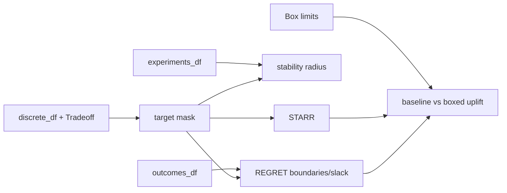

# Robustness metrics and policy impact

`RobustnessAnalyzer` exposes three metrics. `compute_starr(mask)` returns the success fraction, success count, and total count, with `0.0` for an empty mask. `compute_regret(outcomes_df, mask, boundaries, stats)` assigns zero slack to target rows and computes standardized Euclidean distance outside each objective's inclusive target boundaries; it reports mean/max regret and objective contributions. `compute_stability_radius(experiments_df, mask, parameter_cols, ...)` MinMax-normalizes numeric parameters and returns the nearest failing point from a centroid or supplied baseline using Euclidean or cosine distance.

A no-failure stability result is represented by the unit-hypercube proxy (`sqrt(number of parameter columns)` for Euclidean, `2.0` for cosine) and a `no_failures` status, not mathematical infinity. Missing numeric parameters return a zero-radius result with an explanatory detail. REGRET standardization uses the session's training/full `StandardScaler` statistics when available; scheme bin bounds become the target boundaries.

`analyze_robustness_uplift()` groups rows by design-variable signature, computes baseline and in-box metrics, coverage, and count, and appends a `GLOBAL` aggregate. Uplift is boxed minus baseline for STARR and baseline minus boxed for REGRET because higher STARR and lower REGRET are preferable. Empty boxed groups are reported as zero after final fill for boxed/uplift columns. `BoxEvaluator.compute_policy_robustness_matrix()` supplies the policy-by-tradeoff heatmap input: policies are sorted non-null values; each tradeoff gets a unique column name; a missing box yields `None`; fewer than `min_samples` yields `0.0` for STARR/density and `10.0` for REGRET; unknown metrics yield `None`. Boundaries are reconstructed by matching each `Tradeoff.elements` label to its scheme bin. Therefore boxes, schemes, policy series, discrete rows, and continuous rows must share indices; mismatches can make boolean filtering select wrong rows or raise pandas alignment errors.

Session `compute_robustness()` first resolves all/train/test positional indices: `all` uses `experiments_df.index`, while train/test use the stored split arrays, then it filters the policy map by `policy_mask.iloc[idx]` and slices all parallel frames with `.iloc[final_indices]`. Thus split arrays are expected to be integer row positions, not arbitrary labels; a non-default/reordered index can silently mismatch a label-based mask. It finds the first decision column containing the requested policy, builds a target mask from the named tradeoff, and dispatches STARR, REGRET (lazily fitting outcome statistics), or stability radius. Unknown subsets, policies, tradeoffs, and metrics raise `ValueError`; an empty policy intersection returns a zero-valued detail.

REGRET uses `stats['scaler'].scale_` when a scaler is supplied and `numeric_cols` to map standard deviations; a missing scaler, incomplete `scale_`, or mismatched objective names can raise `KeyError`/`AttributeError` or fall back to unit scale only for an objective absent from the stats map. Masks are assumed boolean and index-compatible; pandas alignment can produce NaNs or shape errors if not. `get_policy_robustness_improvement_matrix()` delegates to the box evaluator, while ranking helpers sort policy/metric pairs in descending STARR or ascending REGRET order as implemented by their metric branch; ties retain pandas/Python stable order, and NaN values can sort to the end or be filled by the uplift path. These alignment, scaler, tie, and ranking paths are less directly covered than the standalone metric tests.

Focused evidence: `tests/test_robustness_analyzer.py` verifies STARR counts and fractions; `tests/test_tradeoff_analyzer.py` covers nearest-region analysis adjacent to metric use; session-level matrix/ranking behavior is exercised by `tests/test_archspace_core.py` and `tests/test_tradeoff_entity.py`. Preserve index alignment among experiments, outcomes, discrete labels, and masks when changing metric code.
