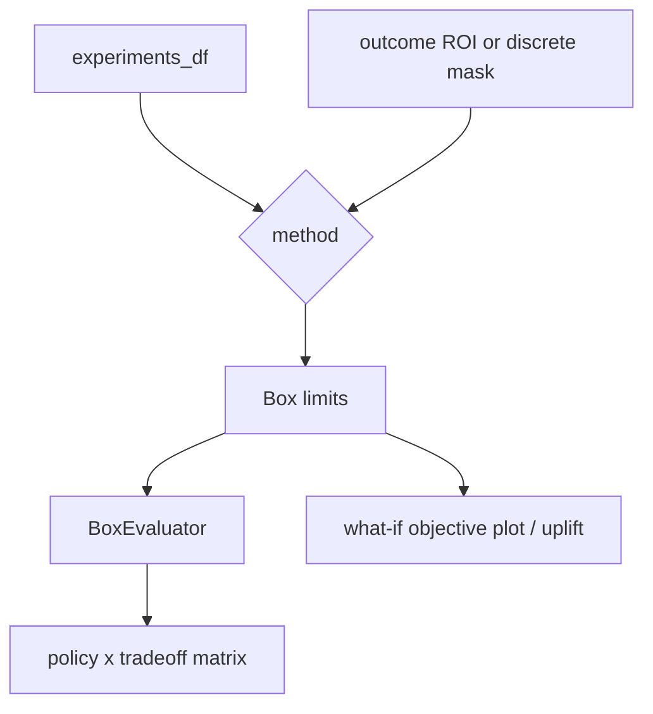

# Scenario discovery and operating boxes

`ScenarioDiscoveryManager` selects discovery implementations; `PRIMDiscovery` and `CARTDiscovery` implement the `ScenarioDiscovery` interface in `adept/analysis/discovery.py`. Discovery consumes `experiments_df` as X and either an outcome ROI/property or a categorical/discrete target. Configuration, policy, model, and scenario columns are excluded from algorithm features unless explicitly selected as key parameters.

PRIM builds a boolean target from `property={outcome: (min,max)}` or accepts `y_mask`, then delegates to either the Rhodium `prim` backend or EMA Workbench PRIM. Missing both `property` and `y_mask` raises `ValueError`; a target with no true rows returns `None` (or `[]` with `n_boxes`). Backend import failures are deferred until execution. It wraps discovered limits in `Box` objects and records density, coverage, mean, and mass where backend metadata provides them. CART requires `discrete_outcomes`, so missing y raises `ValueError`; it builds an EMA CART tree with `mass_min`/`min_samples_leaf`, optionally prunes duplicate leaves, extracts readable rules, intersects path intervals with dataset bounds, and currently retains the first box per class when multiple leaves map to one label. Empty feature frames or incompatible categorical/numeric values are backend errors, not normalized success results.

`BoxEvaluator.evaluate()` is the backend-independent contract: a box mask is the conjunction of inclusive parameter limits; density is targets inside divided by points inside; coverage is targets inside divided by all targets; lift is density minus population prevalence. `compute_policy_robustness_matrix()` applies boxes per policy and tradeoff, returning policy rows and tradeoff columns with STARR/density or REGRET values. Missing boxes produce `None`; insufficient samples produce `0.0` for STARR/density or `10.0` for REGRET.

PRIM/CART imports are optional at module import time, but actual execution requires their packages. Discovery can return no box when no target rows exist. CART's union-of-leaves behavior is intentionally conservative and is a known extension boundary. `Box.actual_limits` resolves infinite limits only when dataset bounds are stored.

Focused evidence: `tests/test_scenario_discovery.py` currently exercises interfaces/stubs and tolerates missing runtime backends; `tests/test_scenario_discovery_paradigms.py` and `tests/test_scenario_discovery_manager.py` cover manager/paradigm behavior. Validate a real discovery change with a small fixture and installed discovery dependencies, then inspect density, coverage, limits, and target labels rather than relying only on successful construction.
