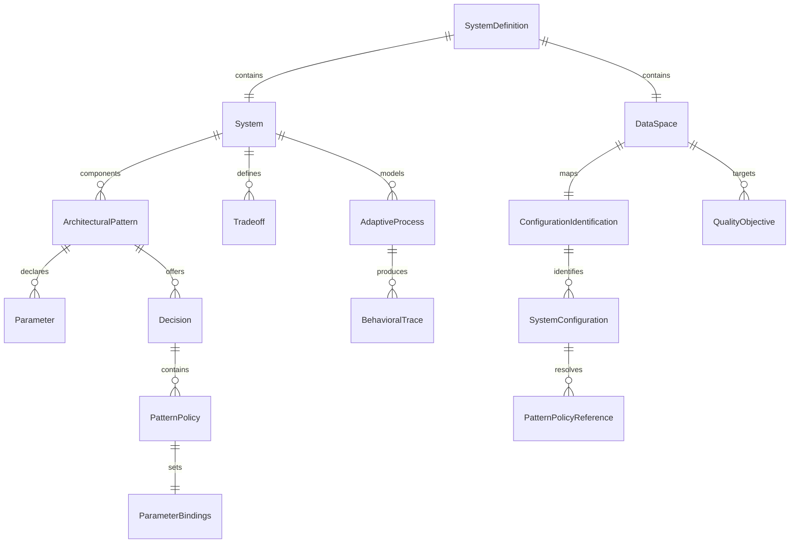

# ADEPT declarative data contract

`SystemDefinition` in `adept/core/models.py` is the root JSON contract. It contains `mode`, a `System`, a `DataSpace`, and free-form metadata. Pydantic models allow extra fields and validate assignment so existing experiment metadata can survive parsing.

## Model layers

`ParameterType` distinguishes `lever`, `uncertainty`, `outcome`, and `constraint`; `ParameterLevel` distinguishes `system`, `pattern`, and `infrastructure`. `ArchitecturalPattern.parameters` and `System.parameters` synchronize missing embedded names from dictionary keys. Decisions map to `PatternPolicy` objects, whose `ParameterBindings` group values by levers, uncertainties, and constraints.

`QualityObjective` defines `name`, units, optimization direction (`maximize`), optional threshold, and `nan_policy` (`worst_case`, `drop`, or `fixed_value`). `Tradeoff.elements` maps objective names to bin labels; `scheme` records discretization, Pareto, or threshold intent. After session processing, `has_points` and `point_count` are populated. `QualityBin` and `DiscretizationScheme` preserve label-to-numeric-boundary mappings. `Box` stores parameter limits, dataset bounds, discovery metrics, target tradeoff, algorithm, and optional NaN inclusion flags; `actual_limits` replaces infinite limits with dataset bounds.

`DataSpace.configuration_identification` accepts the current `configurations` field or the legacy input name `policies`. `ConfigurationIdentification.from_` is populated from JSON key `from` and supports `column` or `file`. A column mode maps a configuration ID column; file mode lists `SystemConfiguration` objects with `source_file`. `Policy` and `PolicyIdentification` remain aliases for compatibility. Pydantic permits extra fields and coerces objective thresholds to floats where possible, so unknown keys generally survive while malformed required nested fields fail during `model_validate`; downstream column absence is a linter issue rather than a schema error.

## Adaptive lifecycle

`AdaptiveProcess` belongs to `System.adaptive_processes` and describes a temporal process using `process_id`, `instance_id`, `process_type`, `cycle_definition`, `initial_state`, and `termination_logic`. It is metadata, not the time-series payload. `DataSpace.traces_path` points to a directory of CSV traces. `GenericDataLoader.load_behavioral_traces()` resolves that path relative to the definition file, scans `*.csv`, derives `scenario_id` and `trace_id` from each basename, and wraps each DataFrame in `BehavioralTrace`. A missing path emits a warning and returns `[]`; no trace is synthesized. See [data loading](../core/data-loading.md) and `tests/test_adaptive_loader.py`.

## Tabular contract

After loading and optional declarative renames, the raw frame contains source columns plus injected parameter columns. `experiments_df` contains component parameter columns (exact or `component_parameter` names) and the configuration column; `outcomes_df` contains columns named by `DataSpace.quality_objectives`. Policy binding values from JSON overwrite existing values where a mapping is explicit; wildcard/`None` entries do not overwrite. Downstream analysis assumes aligned row indices across these frames.

Focused evidence: `tests/test_definitions_models.py` proves nested validation, threshold coercion, aliases/extra fields; `tests/test_tradeoff_entity.py` covers tradeoff model behavior; adaptive schema/loading is covered by `tests/test_adaptive_loader.py`. The JSON examples in `patterns/*/*.json` and `federatedlearning/FLsystem*.json` are concrete contracts, not generated database migrations.
