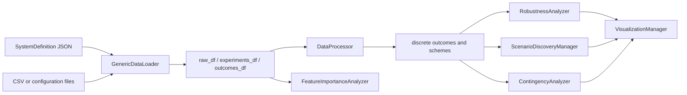

# ADEPT architecture and public API

ADEPT is a Python analysis framework whose stable composition root is `ArchSpaceCore` in `adept/core/coordinator.py`. `PatternAnalysis` in `adept/core/session.py` is the stateful notebook-facing façade; it owns a loaded `SystemDefinition`, raw/experiment/outcome frames, discretized outcomes, discovered tradeoffs, splits, and derived statistics. The coordinator remains deliberately thin: it injects or constructs a `GenericDataLoader`, `SimpleValidator`, `DataProcessor`, `RobustnessAnalyzer`, `TradeoffAnalyzer`, `ScenarioDiscoveryManager`, `ExplanationManager`, and `VisualizationManager`, then delegates work.

## Export layers and façade map

| Import path | Canonical exports | Use |
|---|---|---|
| `adept` | `ArchSpaceCore`, `SystemDefinition`, `GenericDataLoader`, `PatternAnalysis` | application/notebook entrypoints |
| `adept.core` | coordinator, model roots, `DataLoader`, `GenericDataLoader` | composition and schema integration |
| `adept.analysis` | `DataProcessor`, `RobustnessAnalyzer`, `TradeoffAnalyzer`, `ScenarioDiscoveryManager`, `ExplanationManager` | focused analysis components |
| `adept.utils` | validators and tradeoff sorting helpers | supporting contracts |

`adept.analysis.__init__` does not export every implementation (notably contingency, feature importance, or visualization); import those modules directly when extending them. `ArchitectureSpace` is a legacy model container; new declarative workflows use `SystemDefinition`.

`ArchSpaceCore` methods map to domains as follows: `load_system_definition`, `load_data`, and `load_detailed_data` → [data loading](../core/data-loading.md); `validate` → [validation and errors](./validation-and-errors.md); `define_tradeoffs` → [tradeoffs](../analysis/tradeoffs.md); `discover_scenarios` → [scenario discovery](../analysis/scenario-discovery.md); `compute_robustness` and `get_nearest_tradeoffs` → [robustness](../analysis/robustness.md) and [decision impact](../analysis/decision-impact.md); `explain` → [explanations and visualization](../analysis/explanations-and-visualization.md); plotting methods → that same visualization page.

`PatternAnalysis` adds lifecycle methods: `load()` must precede `define_tradeoffs()`; discovery requires loaded experiments plus discretized outcomes; robustness REGRET requires schemes and outcome statistics; policy/contingency methods require configuration identification; `reset(full=True)` clears all state while `reset(full=False)` preserves loaded data and tradeoff definitions. Its methods are the canonical route for session-level features; the domain pages document return artifacts and failure cases.

## Runtime invariants

- JSON names objectives and parameters; loader output must contain objective columns and parameter/configuration columns after injection.
- Tradeoff definitions produce both categorical labels and a `tradeoff_indices` map, which downstream code uses instead of repeatedly recomputing membership.
- `SystemDefinition` is validated by Pydantic before loading; semantic consistency is reported by `SystemLinter` after loading.
- Optional dependencies are imported defensively, but Pareto methods require `paretoset` and PRIM/CART execution requires the relevant discovery backend.

Focused evidence: `tests/test_archspace_core.py`, `tests/test_loader.py`, `tests/test_data_processor.py`, and `tests/test_robustness_analyzer.py` cover coordinator delegation, loading, transformation, and metrics. Use `pytest -q` for the complete local suite; see [testing and development](../testing-and-development.md) for dependency and side-effect caveats.
