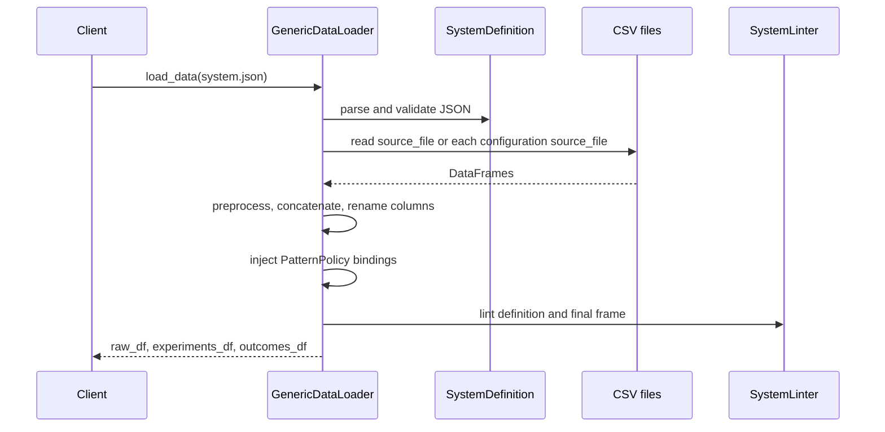

# Metadata-driven data loading

`DataLoader` is the extension seam. `PandasDataLoader` is a thin `pd.read_csv` wrapper; `GenericDataLoader` is the ADEPT path and consumes a `SystemDefinition` JSON file. `ArchSpaceCore.load_data`, `load_system_definition`, and `load_detailed_data` expose these operations to clients.

## Source modes and ordering

A `ArchSpaceCore.load_data(source)` first rejects `None`, then calls `GenericDataLoader.load()` (when the injected loader is generic). `GenericDataLoader.load()` calls `load_system_definition()` → `SystemDefinition.from_json()` → `json.load()` → Pydantic `model_validate`, then `_load_from_definition()` with `os.path.dirname(source)` as the base path. It applies source loading, preprocessing, concatenation, and renames; `_apply_parameter_bindings()` then maps configuration IDs; finally `validate_data_integrity()` lints the final frame. Any exception in this path is caught by the coordinator and re-raised as `DataLoadingError` with the original message in `details`, except the coordinator's explicit `None` guard (`ValueError`).

`DataSpace.source_file` is resolved relative to the JSON directory unless absolute and read as one CSV. Otherwise, `configuration_identification.from_ == "file"` loads each configuration's `source_file`, applies the optional preprocessor per file (with `config_name` when the callable accepts it), adds the identification column if absent, and concatenates frames. `DataSpace.column_renames` runs after loading/preprocessing. Missing configuration files warn and are skipped; if no source can be determined, loading raises `ValueError` before the coordinator wraps it.

The loader then maps configuration IDs to pattern policy references and injects every explicit lever/uncertainty/constraint binding. A dict of configurations uses its keys; a list uses each `SystemConfiguration.name` as the key. Unknown configuration values map to NaN for injected columns; missing identification columns skip injection entirely. An unknown component, decision, or policy reference is skipped by injection but is reported as an `ERROR` by `SystemLinter`; duplicate configuration keys are collapsed by JSON/Python mapping semantics. Existing values are masked only where a mapped value is non-null and not `"*"`; `None` therefore means no override, not a numeric zero. `load_data()` identifies experiment columns from component parameters (exact name, then `component_name_parameter_name`) and the config column, identifies outcome columns from quality objectives, audits NaN proportions, and returns aligned copies. A missing quality-objective column is reported as an `ERROR` by the linter, while partitioning silently omits it if validation is disabled.

Aliases are input-key aliases, not conflict resolution: `policy_identification` is renamed to `configuration_identification`, `policies` to `configurations`, and `from` is exposed as `from_`; definitions should use one spelling. The `DataSpace` pre-validator assigns the legacy `policy_identification` value into the canonical field when present, so supplying both spellings is not a supported merge and the legacy value can win. A malformed alias value (for example a scalar where a nested model is required) fails Pydantic validation before file access. A list of configurations is keyed internally by each name; duplicate names overwrite the earlier entry during `_apply_parameter_bindings` with last occurrence behavior. Missing non-objective parameter columns become `WARNING` linter issues (exact and component-prefixed names are checked); missing objective/configuration columns become `ERROR` issues. Column rename collisions are delegated to pandas and can create duplicate columns; inspect the final frame before relying on exact-name partitioning.

`load_behavioral_traces()` is separate from tabular loading. It resolves `DataSpace.traces_path`, warns/returns an empty list if absent, scans CSV files, and creates `BehavioralTrace(trace_id=scenario_id, scenario_id=scenario_id, outcomes=df)`. `AdaptiveProcess` metadata stays in the model; each trace DataFrame is the runtime time-series payload. See [the data contract](../architecture/data-contract.md).

`preprocessor` is the supported extension hook and may return a transformed DataFrame. A client needing another storage backend should implement `DataLoader.load()` and inject it into `ArchSpaceCore`; it will not receive `GenericDataLoader`'s JSON partitioning unless implemented explicitly.

Focused tests: `tests/test_loader.py` creates temporary JSON/CSV fixtures and verifies parsing, row count, experiment and outcome selection; `tests/test_adaptive_loader.py` checks adaptive metadata and trace discovery; `tests/test_data_processor.py` consumes the resulting outcome contract. The federated-learning preprocessing path is separate and documented in [federated learning](../federated-learning/overview.md).
