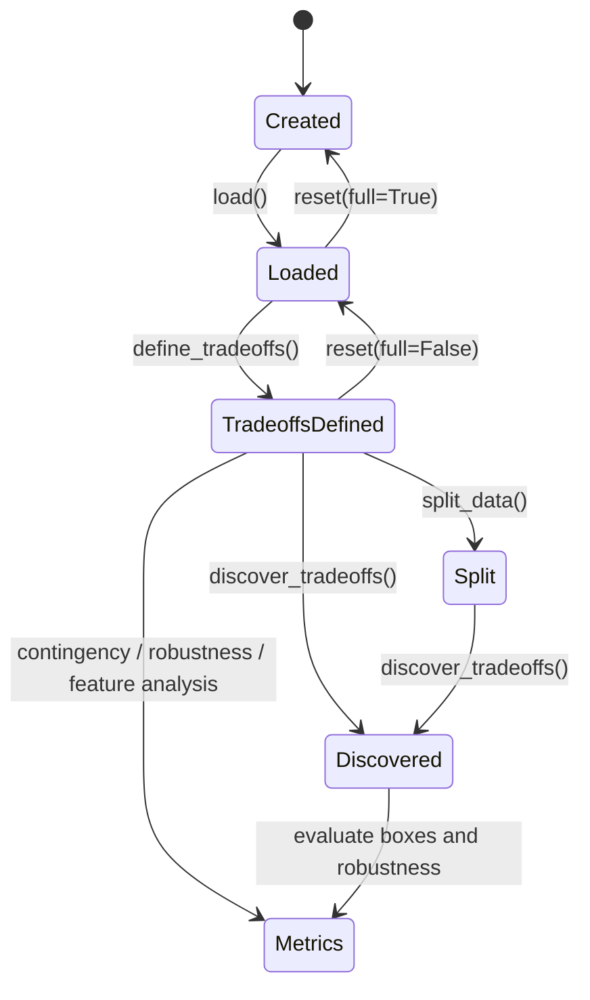

# PatternAnalysis session workflow

`PatternAnalysis(json_path)` owns the user-facing analysis state and delegates computation to `ArchSpaceCore`. `load()` parses the definition, loads and partitions data, audits NaNs, fills only non-optional numeric experiment parameters with `0.0`, and leaves outcome NaNs for semantic objective policies. `reset(full=True)` clears definitions, frames, tradeoffs, schemes, indices, splits, and stats; `reset(full=False)` keeps loaded data and tradeoff definitions but clears derived split/statistics state.

The required ordering is: load before tradeoff definition; tradeoff definition before `get_indices_for_tradeoff`, discovery, contingency, or robustness; `split_data` before `train`/`test` subset operations; outcome statistics are lazily created for standardized REGRET. Tradeoff membership is resolved by matching `Tradeoff.elements` against the categorical `discrete_df` and uses the precomputed `tradeoff_indices` map. `discover_tradeoffs()` catches exceptions independently for each configured tradeoff and records `tradeoff_<name>_error`, allowing later tradeoffs to proceed; direct coordinator/analyzer calls propagate backend errors. This is intentional batch isolation, not proof that a failed box is valid.

The façade routes `define_tradeoffs()` to `DataProcessor`; `discover_tradeoffs()` iterates configured system tradeoffs and delegates to the coordinator with experiments, outcomes, discrete labels, and the selected PRIM/CART method. Policy methods build a decision-policy map through `ContingencyAnalyzer`; robustness methods select policy rows, create target masks, and call `RobustnessAnalyzer`; plotting methods pass prepared subsets and masks to `VisualizationManager`.

The broad public session surface includes `get_policy_contingency_matrix`, `show_policy_contingency`, `get_policy_tradeoff_distribution`, `get_variable_policies`, `get_deterministic_policies`, `get_exclusive_tradeoffs`, `get_policy_robustness_improvement_matrix`, `compute_robustness`, `analyze_robustness_uplift`, `compute_feature_scores`, discovery and box visualization methods, and report/ranking helpers later in `session.py`. Use the domain pages for parameter details; do not bypass state preparation by calling these methods on a fresh session.

NaN handling is intentionally staged: `SemanticNaNHandler.audit_nan_proportions` reports input quality, optional parameter NaNs can become sentinel values for ML/discovery, and outcome NaNs are imputed immediately before tradeoff segmentation according to each `QualityObjective.nan_policy`. See [semantic support](../utilities/nan-and-support.md).

Focused evidence: `tests/test_archspace_core.py`, `tests/test_scenario_discovery_manager.py`, `tests/test_tradeoff_entity.py`, and `federatedlearning/test_manual_simple.py` demonstrate façade and end-to-end expectations. Some manual scripts refer to older method names; treat current `session.py` as authoritative.
